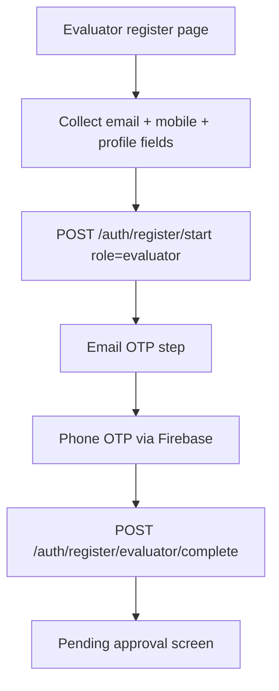
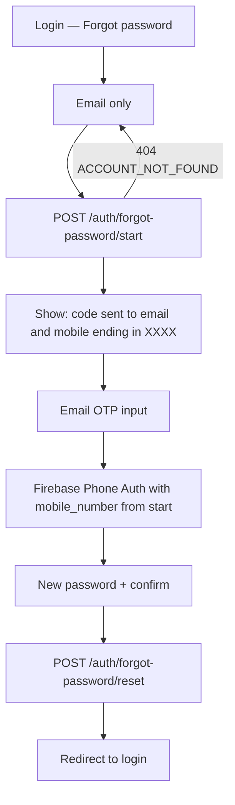
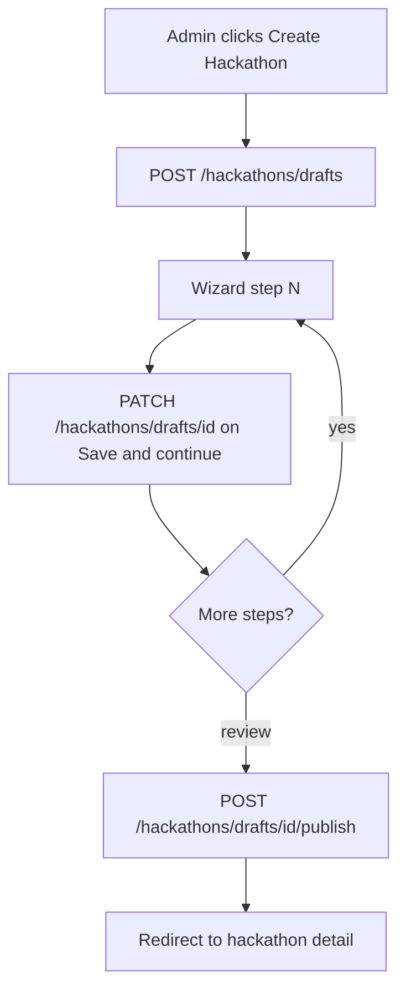

# AI Hackathon Evaluator Backend

FastAPI backend for **HackNIAT** — students submit hackathon demo videos (record in-browser or upload from disk), admins assign **approved evaluators**, evaluators run **Gemini** AI analysis and submit scores for admin approval, and students see the final report/score only after approval.

Stack: **Firebase Auth + Firestore**, **Google Cloud Storage** (videos), **Vertex AI / Gemini** (multimodal video analysis), deployable to **Cloud Run**.

**System design:** [docs/architecture.md](docs/architecture.md) — layers, service graph, Firestore collections, evaluation jobs, and domain flows. API contracts and frontend handoff stay in this README.

## Quick start

```bash
# 1. Create/activate a virtual environment (Python 3.11+)
python -m venv .venv && source .venv/bin/activate   # macOS/Linux
# Windows Git Bash: source .venv/Scripts/activate

# 2. Install dependencies
pip install -e ".[dev]"

# 3. Configure environment
cp .env.example .env           # then fill in the values

# 4. Run
uvicorn app.main:app --reload  # http://localhost:8000/docs
```

## Roles

| Role | Access |
|------|--------|
| **student** | Register team, submit video + requirement answers, view own submissions; see report/`final_score` only after admin approval |
| **evaluator** | Must be `@nxtwave.co.in` and **approved** by admin; works only on **assigned** submissions; can run AI analysis and submit for review |
| **admin** | Manage hackathons/themes/requirements/scoring, assign evaluators, approve evaluations, publish results |

Seeded users (created on startup, password `12345678`):

| Email | Role | Approval |
|-------|------|----------|
| `admin@nxtwave.co.in` | admin | — |
| `evaluator@nxtwave.co.in` | evaluator | approved |
| `evaluator.pending@nxtwave.co.in` | evaluator | pending |
| `student@nxtwave.co.in` | student | approved |

## Authentication

Login sets an HttpOnly `access_token` cookie (not returned in the JSON body). Use `credentials: "include"` (fetch) or `withCredentials: true` (axios).

```bash
curl -X POST http://localhost:8000/auth/login \
  -H "Content-Type: application/json" \
  -c cookies.txt \
  -d '{"email":"student@nxtwave.co.in","password":"12345678"}'
```

- `POST /auth/logout` — clear cookie  
- `GET /auth/me` — current profile (`role`, `approval_status`, …)  
- `POST /auth/change-password` — change password (logged in; requires current password)  
- `POST /auth/forgot-password/start` + email OTP + phone + `POST /auth/forgot-password/reset` — reset without the current password (see [Forgot password](#frontend-handoff--forgot-password-copy-to-frontend-repo))  
- Bearer `Authorization` header still works for Swagger / API clients  

Pending evaluators can call `/auth/me` but other app routes return `403` until approved.

### Registration

**Student** — verified email + mobile, then account creation. **Team formation happens per hackathon** at participation time (see [Hackathon teams](#hackathon-teams-id)):

1. `POST /auth/register/start` — `{ "email", "mobile_number" }` → `{ "session_id" }`
2. `POST /auth/email/send-otp` — `{ "session_id", "email" }`
3. `POST /auth/email/verify-otp` — `{ "session_id", "code" }`
4. Firebase Phone Auth in the browser → `POST /auth/verify-phone-token` — `{ "session_id", "firebase_id_token", "mobile_number" }`
5. `POST /auth/register/complete` — profile + password; returns same session as login (`csrf_token` + cookies)

Errors use `{ "detail": { "code", "message" } }` (e.g. `EMAIL_TAKEN`, `INVALID_CODE`, `NOT_VERIFIED`).

**Email OTP (ops):** Cloud Run uses **`EMAIL_PROVIDER=smtp`** with **Brevo** (`smtp-relay.brevo.com:587`). Store `SMTP_USERNAME` and `SMTP_PASSWORD` in Secret Manager per GCP project; set `SMTP_FROM` to a Brevo-verified sender. See [Brevo email setup](#brevo-email-otp-setup). Local dev logs OTP to stdout unless you set `EMAIL_PROVIDER=smtp` in `.env`.

**Phone Auth (ops):** enable Phone in Firebase Console; add authorized domains (`127.0.0.1`, staging/prod frontend URLs). Local dev: use `http://127.0.0.1:5173` (Firebase blocks `localhost`). Optional fictional test numbers under Authentication → Phone → testing; frontend can set `VITE_FIREBASE_PHONE_TEST_MODE=true` locally.

**Evaluator** — same verified email + mobile flow as students, then profile completion. Account starts as `pending` until admin approval:

1. `POST /auth/register/start` — `{ "role": "evaluator", "email" }` **or** `{ "role": "evaluator", "mobile_number" }` → `{ "session_id" }`; call again with `session_id` to attach the other identifier (same as student). When email is included it must be `@nxtwave.co.in`.
2. `POST /auth/email/send-otp` — `{ "session_id", "email" }`
3. `POST /auth/email/verify-otp` — `{ "session_id", "code" }`
4. Firebase Phone Auth in the browser → `POST /auth/verify-phone-token` — `{ "session_id", "firebase_id_token", "mobile_number" }`
5. `POST /auth/register/evaluator/complete` — `{ session_id, first_name, last_name, employee_id, email, mobile_number, password }`; returns session cookies + `approval_status: "pending"`

`POST /auth/register/evaluator` (legacy direct register) returns **410 Gone** — use the verified flow above.

Errors use `{ "detail": { "code", "message" } }` (e.g. `EMAIL_TAKEN`, `INVALID_CODE`, `NOT_VERIFIED`, `EMPLOYEE_ID_TAKEN`, `ROLE_MISMATCH`).

## Frontend handoff — evaluator registration (copy to frontend repo)

Reuse the **same single-page verification UX** as student registration (email OTP + Firebase Phone Auth). Differences are called out below.

### Flow overview



### Step 1 — Start session (email or mobile first, same as student)

Evaluators verify email and mobile **independently**. Start with whichever field the user completes first, then merge the other:

```ts
// First identifier (email OR mobile)
let sessionId = (
  await api.post("/auth/register/start", {
    role: "evaluator",
    email: "name@nxtwave.co.in", // OR mobile_number only on first call
  })
).session_id;

// When the second field is ready, merge into the same session
sessionId = (
  await api.post("/auth/register/start", {
    role: "evaluator",
    session_id: sessionId,
    email: "name@nxtwave.co.in",
    mobile_number: "+919876543210",
  })
).session_id;
```

When `email` is present it must end with `@nxtwave.co.in`. Store `session_id` (30-minute TTL).

### Steps 2–4 — Same as student

| Step | Endpoint | Body |
|------|----------|------|
| Send email OTP | `POST /auth/email/send-otp` | `{ session_id, email }` |
| Verify email | `POST /auth/email/verify-otp` | `{ session_id, code }` |
| Verify phone | `POST /auth/verify-phone-token` | `{ session_id, firebase_id_token, mobile_number }` |

Use the **same Firebase Phone Auth widget** as student registration (`RecaptchaVerifier` + `signInWithPhoneNumber`). After success, send the Firebase ID token to the backend (temporary Phone Auth user is deleted server-side).

**UI gates:** disable **Complete registration** until both `email_verified` and `phone_verified` (track locally after each step succeeds).

### Step 5 — Complete profile

```ts
await api.post("/auth/register/evaluator/complete", {
  session_id,
  first_name,
  last_name,
  employee_id,
  email,           // must match verified session email
  mobile_number,   // must match verified session phone
  password,
  confirm_password,
});
```

**Password rules:** min 8 chars, at least 1 letter and 1 number (same as student verified flow).

**Success response:** same shape as login — `user_id`, `email`, `name`, `role: "evaluator"`, `approval_status: "pending"`, `csrf_token` + HttpOnly session cookies.

Show a **pending approval** screen:

> Your evaluator account has been submitted. An administrator will review and approve your account before you can access submissions.

User can still call `GET /auth/me` but most app routes return `403` until `approval_status === "approved"`.

### Error codes to handle

| Code | When | UI |
|------|------|-----|
| `EMAIL_TAKEN` / `PHONE_TAKEN` | start or complete | Inline field error |
| `EMPLOYEE_ID_TAKEN` | complete | Inline field error |
| `INVALID_CODE` / `EXPIRED` | email verify | Toast + resend |
| `RESEND_COOLDOWN` | send OTP | Show countdown |
| `NOT_VERIFIED` | complete early | Block submit |
| `ROLE_MISMATCH` | wrong complete endpoint | Should not happen if UI is role-scoped |
| `DEPRECATED` | old `POST /auth/register/evaluator` | Migrate to verified flow |

### Suggested page layout

Single page with sections (mirror student register):

1. **Account** — first name, last name, employee ID, Nxtwave email, mobile, password, confirm password
2. **Verify email** — Send code / 6-digit input / verified badge
3. **Verify mobile** — Firebase phone widget / verified badge
4. **Submit** — enabled only when both verifications succeed

Optional: call `register/start` when email + mobile are both valid (debounced) to obtain `session_id` early, then run OTP steps.

### TypeScript types

```ts
type RegisterStartEvaluator = {
  role: "evaluator";
  email: string;
  mobile_number: string;
  session_id?: string; // include when updating session
};

type EvaluatorRegisterComplete = {
  session_id: string;
  first_name: string;
  last_name: string;
  employee_id: string;
  email: string;
  mobile_number: string;
  password: string;
  confirm_password?: string;
};
```

## Frontend handoff — forgot password (copy to frontend repo)

Unauthenticated. **Email-only start.** If the address is in Firestore, the backend emails an OTP immediately and returns the registered mobile (show **last 4 digits** only). Then verify email OTP + Firebase Phone Auth (same widgets as register). Works for student, evaluator, and admin.

Do **not** call `POST /auth/register/start` or `/register/complete`. Reset sessions return `PURPOSE_MISMATCH` on those endpoints.

### Flow overview



### Step 1 — Start (email only)

```ts
const started = await api.post("/auth/forgot-password/start", {
  email: "student@example.com",
});
// started.session_id
// started.message  e.g. "Verification code sent to your email and registered mobile ending in 3210"
// started.mobile_last4  e.g. "3210"  — SHOW THIS
// started.mobile_number e.g. "+919876543210" — use for Phone Auth, do not display
```

Show `started.message` (or your own copy using `mobile_last4`). Store `session_id` (30-minute TTL) and `mobile_number` for step 3.

| Status | `detail.code` | UI |
|--------|----------------|-----|
| 404 | `ACCOUNT_NOT_FOUND` | “No account found with this email.” |
| 400 | `PHONE_NOT_ON_FILE` | Account has no mobile on file — contact admin. |
| 429 | `RATE_LIMITED` / `RESEND_COOLDOWN` | Wait, then retry. |
| 422 | validation | Invalid email. |

Do **not** ask for mobile on this screen.

### Step 2 — Email OTP

The email code was **already sent** in step 1. Collect the 6-digit code:

`POST /auth/email/verify-otp` `{ session_id, code }`

Resend: `POST /auth/email/send-otp` `{ session_id, email }` (60s cooldown). Same codes as register: `INVALID_CODE`, `EXPIRED`, `TOO_MANY_ATTEMPTS`.

### Step 3 — Mobile OTP (Firebase Phone Auth)

Immediately after start (or after email verify), call Firebase `signInWithPhoneNumber(started.mobile_number)` so SMS goes to the registered number. Then:

`POST /auth/verify-phone-token` `{ session_id, firebase_id_token, mobile_number: started.mobile_number }`

UI copy: “Enter the code sent to ••••{mobile_last4}”. Never render the full `mobile_number`.

### Step 4 — New password

```ts
await api.post("/auth/forgot-password/reset", {
  session_id,
  email,
  mobile_number: started.mobile_number,
  new_password,
  confirm_password,
});
```

No login cookies. Redirect to login. Password: 8+ chars, 1 letter, 1 number.

### Types

```ts
type ForgotPasswordStartResponse = {
  session_id: string;
  message: string;
  mobile_last4: string;
  mobile_number: string; // Phone Auth only — do not display
};
```

## Brevo email OTP setup

Registration email codes are sent by the **backend over SMTP** (not Firebase Auth email). Mobile OTP still uses Firebase Phone Auth. You can use **one Brevo account** for both staging and production; use the same SMTP key or separate keys per environment.

### 1. Brevo dashboard

1. Sign in at [brevo.com](https://www.brevo.com).
2. **Senders & IP → Senders** — add and verify **`noreply@mail.nxtlab.tech`**. Complete domain DNS (SPF/DKIM) for `mail.nxtlab.tech` if Brevo asks — improves deliverability.
3. **SMTP & API → SMTP** — click **Generate SMTP key** (login for SMTP is **`noreply@mail.nxtlab.tech`** when using a sender-based key).

### 2. Secret Manager (each GCP project: staging + production)

Create **`SMTP_USERNAME`** and **`SMTP_PASSWORD`** in **both** GCP projects (staging + production):

```bash
# Brevo SMTP login (noreply@mail.nxtlab.tech)
echo -n 'noreply@mail.nxtlab.tech' | gcloud secrets create SMTP_USERNAME --data-file=-
# Or add a new version if the secret already exists:
# echo -n 'noreply@mail.nxtlab.tech' | gcloud secrets versions add SMTP_USERNAME --data-file=-

# Brevo SMTP key (starts with xsmtpsib-…)
echo -n 'xsmtpsib-your-key-here' | gcloud secrets create SMTP_PASSWORD --data-file=-
```

Grant the Cloud Run service account access to read these secrets (same as your Firebase secrets).

### 3. Cloud Build / Cloud Run

`cloudbuild.yaml` already sets:

| Variable | Source | Default (production trigger) |
|----------|--------|------------------------------|
| `EMAIL_PROVIDER` | env | `smtp` |
| `SMTP_HOST` | substitution `_SMTP_HOST` | `smtp-relay.brevo.com` |
| `SMTP_PORT` | substitution `_SMTP_PORT` | `587` |
| `SMTP_FROM` | substitution `_SMTP_FROM` | `noreply@mail.nxtlab.tech` |
| `SMTP_FROM_NAME` | env | `Challazo` |
| `SMTP_USERNAME` | Secret Manager | `noreply@mail.nxtlab.tech` |
| `SMTP_PASSWORD` | Secret Manager | Brevo SMTP key |

**Staging trigger:** override `_SMTP_FROM` if you use a different verified sender for staging (optional — same sender is fine).

Redeploy after creating secrets. Test registration → email Verify → inbox (check spam once).

### 4. Local testing with Brevo (optional)

In `.env`:

```env
ENVIRONMENT=development
EMAIL_PROVIDER=smtp
SMTP_HOST=smtp-relay.brevo.com
SMTP_PORT=587
SMTP_USERNAME=noreply@mail.nxtlab.tech
SMTP_PASSWORD=xsmtpsib-your-key
SMTP_FROM=noreply@mail.nxtlab.tech
SMTP_FROM_NAME=Drop
```

Restart uvicorn and trigger email OTP.

### 5. Alternative: Firebase Trigger Email + Brevo (optional)

If you prefer the extension instead of direct SMTP, set `EMAIL_PROVIDER=firestore` on Cloud Run and install **Trigger Email** (`firestore-send-email`) in **each** Firebase project (staging + prod):

| Extension setting | Value |
|-------------------|--------|
| Mail collection | `mail` |
| SMTP connection URI | `smtps://noreply@mail.nxtlab.tech:xsmtpsib-key@smtp-relay.brevo.com:587` |
| Default FROM | `noreply@mail.nxtlab.tech` |

The backend then writes to Firestore `mail` and the extension sends via Brevo. **Recommended path is direct SMTP** (section 1–3) — fewer moving parts.

### Troubleshooting

| Symptom | Check |
|---------|--------|
| API 500 on send-otp | Cloud Run logs; missing `SMTP_*` secrets or unverified `SMTP_FROM` |
| No email, API 200 | Brevo dashboard → **Transactional → Logs**; sender not verified |
| Email in spam | Complete Brevo domain authentication (SPF/DKIM) |
| Works on staging, not prod | Secrets created in **both** GCP projects; `_SMTP_FROM` verified in Brevo |
| `429 RATE_LIMITED` for many students on same Wi‑Fi | Fixed: per-IP cap is 2000/hour (was 5). Redeploy. See below. |

### 6. Concurrent registration (campus Wi‑Fi / ~500 people)

**What was wrong:** OTP send counted **5 emails per hour per IP**. Everyone on the same Wi‑Fi shares one public IP, so the 6th student got `Too many verification requests`.

**What the backend does now (unchanged per person):**

| Cap | Default | Meaning |
|-----|---------|---------|
| Per **email** | 5 / hour | Same inbox cannot request endless codes |
| Resend cooldown | 60 seconds | Same session must wait to resend |
| Per **IP** | **2000 / hour** | Shared NAT can register a large batch |
| Wrong OTP tries | 5 | Unchanged |

**Steps for you (ops):**

1. **Deploy this backend** (Cloud Build already sets `OTP_MAX_SENDS_PER_IP_PER_HOUR=2000`).
2. **Brevo plan** — open [Brevo pricing / credits](https://www.brevo.com/pricing/). 500 registrations ≈ 500+ OTP emails (plus resends). Free tiers are often ~300/day; use a paid transactional plan before the event.
3. **Confirm sender** — `noreply@mail.nxtlab.tech` verified, SPF/DKIM OK (same as section 1).
4. **Optional Cloud Run headroom** (SMTP still opens one connection per email):

```bash
gcloud run services update ai-hackathon-evaluator-backend \
  --region=asia-south1 \
  --max-instances=20 \
  --concurrency=80 \
  --cpu=1 \
  --memory=1Gi
```

5. **Optional local `.env`:**

```env
OTP_MAX_SENDS_PER_EMAIL_PER_HOUR=5
OTP_MAX_SENDS_PER_IP_PER_HOUR=2000
```

Set `OTP_MAX_SENDS_PER_IP_PER_HOUR=0` to turn off the IP cap entirely. Do **not** raise the per-email cap unless you want more resends per inbox.

6. After a test spike, old counters live in Firestore `otp_rate_limits` for up to 1 hour. You do not need to delete them unless you are debugging.

Phone OTP is still **Firebase Phone Auth** (not Brevo). If SMS fails at the same event, check Firebase Authentication → SMS quota, not this email limiter.

## End-to-end flows

### 1. Student submission (record **or** local upload → GCS)

Prefer the **signed-URL** path. Cloud Run rejects multipart bodies over ~**32 MiB** with `413 Content Too Large`.

```text
GET  /submissions/accepted-video-types   → MIME/ext/max size for UI
POST /submissions/upload-url             → signed GCS PUT URL
Browser PUT  → storage.googleapis.com    → video lands in GCS
POST /submissions/from-upload            → create Firestore submission
```

Both **in-browser recording** and **local file upload** use the same APIs. Optional `video_source`: `"recorded"` | `"uploaded"`.

GCS object layout: `submissions/{student_id}/{submission_id}/video.{ext}`

**GCS bucket CORS** must allow the frontend origin (required for browser PUT). Deploy via Cloud Build applies CORS; for local `http://localhost:5173` you may need to set it once on the bucket (see [GCS CORS](#gcs-cors-for-direct-uploads)).

Legacy multipart (small files only): `POST /submissions` with form fields + `video` file.

Students **do not** start AI analysis. After submit they wait until an evaluator finishes and an admin approves.

### 2. Admin: assign evaluators

```text
GET  /admin/evaluators?approval_status=approved
POST /submissions/{id}/assign                         { "evaluator_id": "..." }
POST /submissions/admin/hackathons/{id}/assign-equally
     { "submission_ids": ["..."], "evaluator_ids": ["..."]? }   # random equal split
```

### 3. Evaluator: analyze → submit for review

```text
GET  /submissions/evaluator/hackathons
GET  /submissions/evaluator/hackathons/{hackathon_id}   # assigned only
POST /submissions/{id}/evaluate                         # AI analysis (202)
POST /submissions/{id}/submit-for-review
     { "final_score": 0-100, "evaluator_notes": "..."? }
```

`review_status`: `none` → `pending_review` → `approved` | `changes_requested`

### 4. Admin: approve → student sees results

```text
POST /submissions/{id}/approve-evaluation
     { "final_score": ...?, "review_notes": ...? }   # publishes report + score
POST /submissions/{id}/request-changes               # send back to evaluator
```

After approval: `report_published=true`, student can read analysis/report/`final_score`.

---

## API overview

Interactive docs (local / non-production): `http://localhost:8000/docs`

Paths below are **public absolute URLs** (same as OpenAPI when docs are enabled). Do not rename
these without an API version bump. In production, `/docs`, `/redoc`, and `/openapi.json` are
disabled by default (`ENVIRONMENT=production`); set `ENABLE_API_DOCS=true` only if needed.

### Health / root

| Method | Path | Auth | Description |
|--------|------|------|-------------|
| GET | `/health` | — | Liveness |
| GET | `/` | — | Service welcome |

### Auth — `/auth`

| Method | Path | Auth | Description |
|--------|------|------|-------------|
| POST | `/auth/register/start` | — | Create verification session |
| POST | `/auth/email/send-otp` | — | Email 6-digit OTP |
| POST | `/auth/email/verify-otp` | — | Confirm email OTP |
| POST | `/auth/verify-phone-token` | — | Confirm Firebase Phone Auth token |
| POST | `/auth/register/complete` | — | Create student + session cookies |
| POST | `/auth/register/evaluator/complete` | — | Create evaluator (verified) + session cookies (`pending`) |
| POST | `/auth/register/evaluator` | — | **Deprecated** (410) — use verified flow |
| POST | `/auth/forgot-password/start` | — | If email is registered, send OTP; return masked mobile |
| POST | `/auth/forgot-password/reset` | — | Set new password after email + phone verified |
| POST | `/auth/login` | — | HttpOnly cookie session |
| POST | `/auth/logout` | — | Clear cookie |
| POST | `/auth/change-password` | user | Change password |
| GET | `/auth/me` | user | Current profile |

### Admin users — `/admin`

| Method | Path | Description |
|--------|------|-------------|
| GET | `/admin/users` | Non-admin users |
| GET | `/admin/evaluators/pending` | Pending evaluators |
| GET | `/admin/evaluators` | Evaluators (`?approval_status=pending\|approved`) |
| POST | `/admin/evaluators/{id}/approve` | Approve evaluator |
| GET/PATCH | `/admin/user/{id}` | Get / update user |

### Hackathons — `/hackathons`

CRUD for hackathons (banner, themes, timeline, `hackathon_url`, linked evaluation requirements). Public list/detail for authenticated users; create/update/delete are admin.

**Homepage catalog (public):** `GET /hackathons/catalog` — see [Frontend handoff — home catalog](#frontend-handoff--home-hackathon-catalog-copy-to-frontend-repo).

**Per-round settings:** each object in the `timeline` JSON array supports:

| Field | Type | Default | Description |
|-------|------|---------|-------------|
| `title` | string | required | Round name (e.g. "Round 1") |
| `description` | string | optional | Round description |
| `start_date` / `end_date` | ISO date | optional | Round window |
| `evaluation_requirement_id` | string | optional | Linked requirement form |
| `max_team_size` | 1–4 | `1` | Team size including leader (`1` = Solo) |
| `working_demo_video_required` | bool | `true` | Require demo video for this round's submission |
| `auto_ai_evaluation` | bool | `false` | Auto-queue AI when admin assigns evaluators |
| `github_ai_evaluation` | bool | `false` | Allow evaluators to run AI GitHub repo analysis |

| `published` | bool | `false` | Admin must publish before students see the round |
| `published_at` | string | — | Set by publish API (IST) |
| `published_by` | string | — | Admin uid who published |
| `round_status` | string | computed | `draft` \| `scheduled` \| `open` \| `closed` (IST dates) |

Responses enrich each round with `team_mode_label`. **Legacy:** hackathon-level flags on older docs still apply as fallbacks when a round omits per-round fields.

**Removed from hackathon create/update form:** top-level demo-video / auto-AI multipart fields — configure them **inside each round** in `timeline` JSON instead.

#### Hackathon creation drafts (admin wizard cart)

Save-and-continue while creating a hackathon. Each wizard section persists to Firestore (`hackathon_drafts`); on final publish the draft becomes a real hackathon and the draft is deleted.

| Method | Path | Auth | Description |
|--------|------|------|-------------|
| POST | `/hackathons/drafts` | admin | Create empty draft |
| GET | `/hackathons/drafts` | admin | List drafts (inbox) |
| GET | `/hackathons/drafts/{id}` | admin | Load draft to resume |
| PATCH | `/hackathons/drafts/{id}` | admin | Save section (partial JSON) |
| POST | `/hackathons/drafts/{id}/banner` | admin | Upload/replace banner |
| POST | `/hackathons/drafts/{id}/publish` | admin | Validate all fields → create hackathon |
| DELETE | `/hackathons/drafts/{id}` | admin | Discard draft |

Draft sections (`current_step` / `completed_steps`): `basics` → `guidelines` → `themes` → `timeline` → `prizes` → `banner` → `review`.

Errors: `DRAFT_NOT_FOUND`, `DRAFT_INCOMPLETE`, `DRAFT_INVALID`.

See [Frontend handoff — hackathon drafts](#frontend-handoff--hackathon-drafts-copy-to-frontend-repo) below.

### Admin round publish — `POST /hackathons/{id}/rounds/{round_index}/publish`

Admin publishes rounds one at a time after hackathon creation. **Students only see published rounds** (`GET /hackathons/{id}` filters `timeline` for `role=student`).

**IST date checks on publish:**
- Rejects if `end_date` is already in the past (`ROUND_ENDED`)
- Allows publish before `start_date` (round shows as `scheduled` until the start date)

**Round window for submissions (IST calendar days):**
- `scheduled` — published, before `start_date` (students may form teams; cannot submit yet)
- `open` — published, within `start_date`–`end_date` inclusive
- `closed` — after `end_date`

| Method | Path | Auth | Description |
|--------|------|------|-------------|
| POST | `/hackathons/{id}/rounds/{round_index}/publish` | admin | Publish round for students |
| GET | `/hackathons/{id}/rounds/{round_index}/leaderboard` | any authenticated | Ranked results (students only after leaderboard publish) |
| POST | `/hackathons/{id}/rounds/{round_index}/leaderboard/publish` | admin | Publish/unpublish ranks and email candidates |

Publish error codes: `ROUND_NOT_FOUND`, `ROUND_ENDED`, `ALREADY_PUBLISHED`, `INVALID_ROUND_DATES`.

### Hackathon teams — `/hackathons/{id}/rounds/{round_index}/…`

`round_index` is **0-based** (matches the `timeline` array: `0` = first round, `1` = second, …).

Per-round enrollment before submission. Solo rounds (`max_team_size = 1`) use the existing submit flow after one enroll call. Team rounds (`2–4`) require leader/member setup; **only the team leader can submit for that round**.

| Method | Path | Auth | Description |
|--------|------|------|-------------|
| GET | `/hackathons/{id}/rounds/{round_index}/participation` | student | Enrollment status for this round |
| POST | `/hackathons/{id}/rounds/{round_index}/enroll/solo` | student | Solo enroll (round `max_team_size = 1`) |
| POST | `/hackathons/{id}/rounds/{round_index}/teams/create` | student | Leader creates team with `{ "team_name": "..." }` → 6-digit join code (5 min) |
| POST | `/hackathons/{id}/rounds/{round_index}/teams/join` | student | Member joins with `{ "code": "123456" }` |
| POST | `/hackathons/{id}/rounds/{round_index}/teams/join-code` | student (leader) | Refresh join code |

**Error codes:** `ROUND_NOT_PUBLISHED`, `ROUND_NOT_OPEN`, `ROUND_CLOSED`, `ROUND_NOT_FOUND`, `TEAM_INCOMPLETE`, `TEAM_NAME_REQUIRED`, `TEAM_REQUIRED`, `SOLO_HACKATHON`, `ALREADY_ENROLLED`, `INVALID_CODE`, `EXPIRED`, `TEAM_FULL`, `LEADER_ONLY`, `NOT_ENROLLED`.

**Team complete gate:** for team rounds, the **leader cannot submit** until `team.member_count === team.max_members`. Participation returns `can_continue_to_demo: false`, `pending_action: "complete_team"`, `block_reason: "Please complete your team to move to demo video"`. Frontend should toast that message when the leader clicks **Continue to Demo**.

**Submission guard:** include `round_index` on submit; backend also requires round `open` + full team (leader) or solo enroll.

#### Frontend UI flow (student)

1. **Hackathon detail** — list each `timeline` round with its `team_mode_label`, dates, and a **Submit for Round N** (or **Participate**) action per round.
2. **On round action** — `GET /hackathons/{id}/rounds/{round_index}/participation`:
   - `pending_action === "solo_enroll"` → **Enroll & Submit** → `POST …/enroll/solo` → open submit wizard with `round_index`.
   - `pending_action === "choose_role"` → modal: **Team Leader** | **Team Member**.
   - Leader → **Team name** input (required) → `POST …/teams/create` with `{ "team_name": "Alpha Squad" }` → show team name, 6-digit code + 5-minute countdown; roster; submit when `can_submit`.
   - Member → join code input → `POST …/teams/join` → roster only; no submit button.
3. **Multi-round hackathons** — enrollment is **independent per round** (Round 1 team ≠ Round 2 team; a student can be leader in one round and solo in another).
4. **Submit wizard** — always send `round_index` matching the round being submitted.

Example timeline JSON (admin):

```json
[
  {
    "title": "Round 1",
    "description": "Idea submission",
    "start_date": "2026-09-01",
    "end_date": "2026-09-15",
    "evaluation_requirement_id": "req-round1",
    "max_team_size": 4,
    "working_demo_video_required": true,
    "auto_ai_evaluation": false
  },
  {
    "title": "Round 2",
    "description": "Final demo",
    "start_date": "2026-09-16",
    "end_date": "2026-09-30",
    "evaluation_requirement_id": "req-round2",
    "max_team_size": 1,
    "working_demo_video_required": false,
    "auto_ai_evaluation": true
  }
]
```

#### Frontend UI flow (admin) — round editor

Remove hackathon-level **Working demo video required** and **Auto AI evaluation on assign** toggles from the main form. Add them **per round row** in the timeline editor, together with team size:

| Control | Maps to | Default |
|---------|---------|---------|
| Team size dropdown | `max_team_size` | `1` (Solo) |
| ☑ Working demo video required | `working_demo_video_required` | checked (`true`) |
| ☐ Auto AI evaluation on assign | `auto_ai_evaluation` | unchecked (`false`) |

When saving, serialize the full `timeline` array (including all round fields) into the multipart `timeline` form field as JSON. On edit, hydrate checkboxes from `GET /hackathons/{id}` → `hackathon.timeline[i]`.

---

## Frontend handoff — hackathon drafts (copy to frontend repo)

Admin **Create Hackathon** should use a multi-step wizard with **Save & continue** per section. Data persists server-side so admins can leave and resume later.

### Wizard sections

| Step | `current_step` | Fields saved via PATCH |
|------|----------------|------------------------|
| 1 Basics | `basics` | `name`, `description`, `start_date`, `end_date`, `hackathon_url` |
| 2 Guidelines | `guidelines` | `guidelines`, `evaluator_guidelines` |
| 3 Themes | `themes` | `theme_ids` |
| 4 Timeline | `timeline` | `timeline` (full round array JSON) |
| 5 Prizes | `prizes` | `prizes` `{ winner, first_runner_up, second_runner_up }` |
| 6 Banner | `banner` | `POST …/banner` multipart (optional image) |
| 7 Review | `review` | read-only summary → publish |

### Flow



### On first visit (new hackathon)

```ts
const draft = await api.post("/hackathons/drafts"); // optional initial payload
const draftId = draft.id;
// store draftId in URL: /admin/hackathons/create?draftId=...
```

### On Save & continue (each section)

```ts
await api.patch(`/hackathons/drafts/${draftId}`, {
  current_step: "basics",           // next step to show
  completed_steps: ["basics"],      // all finished steps so far
  name,
  description,
  start_date,
  end_date,
  hackathon_url,
});
```

Send **only the fields for the current section** plus `current_step` / `completed_steps`. Partial empty fields are allowed in drafts.

### Banner step

```ts
const form = new FormData();
form.append("banner", file);
await api.post(`/hackathons/drafts/${draftId}/banner`, form);
await api.patch(`/hackathons/drafts/${draftId}`, {
  current_step: "review",
  completed_steps: [..., "banner"],
});
```

### Final publish

```ts
const hackathon = await api.post(`/hackathons/drafts/${draftId}/publish`);
// draft deleted server-side; navigate to /admin/hackathons/{hackathon.id}
```

On `DRAFT_INCOMPLETE` / `DRAFT_INVALID`, show which sections are missing and jump the wizard back.

### Drafts inbox (admin dashboard)

On admin home or hackathons list, fetch drafts:

```ts
const drafts = await api.get("/hackathons/drafts");
// [{ id, title, current_step, completed_steps, updated_at, ... }]
```

Show a **Drafts** tab/card list:
- Title: `title` (falls back to "Untitled hackathon draft")
- Subtitle: `Last edited {updated_at}` · `Step: {current_step}`
- **Continue editing** → `/admin/hackathons/create?draftId={id}`

On mount with `?draftId=`:

```ts
const draft = await api.get(`/hackathons/drafts/${draftId}`);
// hydrate form state; open wizard at draft.current_step
```

### TypeScript types

```ts
type DraftStep =
  | "basics"
  | "guidelines"
  | "themes"
  | "timeline"
  | "prizes"
  | "banner"
  | "review";

type HackathonDraftUpdate = {
  current_step?: DraftStep;
  completed_steps?: DraftStep[];
  name?: string;
  description?: string;
  start_date?: string;
  end_date?: string;
  guidelines?: string;
  evaluator_guidelines?: string;
  hackathon_url?: string;
  theme_ids?: string[];
  timeline?: TimelineRound[];
  prizes?: Partial<{
    winner: string;
    first_runner_up: string;
    second_runner_up: string;
  }>;
};

type HackathonDraft = HackathonDraftUpdate & {
  id: string;
  status: "draft";
  banner_url?: string | null;
  created_by: string;
  created_at: string;
  updated_at: string;
};

type HackathonDraftSummary = {
  id: string;
  title: string;
  current_step: DraftStep;
  completed_steps: DraftStep[];
  updated_at: string;
};
```

### UX notes

- Auto-save optional: debounce PATCH on field blur within a section, but always PATCH on explicit **Save & continue**.
- Show step checklist with ✓ for each item in `completed_steps`.
- **Discard draft** → `DELETE /hackathons/drafts/{id}` with confirm dialog.
- Direct `POST /hackathons` (multipart) still works for one-shot create without drafts.

---

## Frontend handoff — admin submission export (copy to frontend repo)

Let admins sync hackathon submission data to a **linked Google Spreadsheet** from the **Submissions** admin area. One tab per timeline round plus a Summary tab. Re-sync refreshes the same sheet — no `.xlsx` download.

### GCP setup (ops / backend)

Enable on the Firebase/GCP project (same service account as Firestore/GCS):

1. **Google Sheets API**
2. **Google Drive API**

The backend uses `FIREBASE_PRIVATE_KEY` + `FIREBASE_CLIENT_EMAIL`.

**Important:** Firebase service accounts **cannot** create spreadsheets in their own Drive (no storage quota). One-time setup:

1. As `admin@nxtwave.co.in` (or any user), create a Google Drive folder e.g. **Hackathon Exports**
2. **Share** the folder with `firebase-adminsdk-fbsvc@nxt-acad-hackathon.iam.gserviceaccount.com` as **Editor**
3. Copy the folder id from the URL: `https://drive.google.com/drive/folders/FOLDER_ID_HERE`
4. Set in `.env` / Cloud Run:

```env
GOOGLE_SHEETS_EXPORT_FOLDER_ID=FOLDER_ID_HERE
```

### API

```http
POST /submissions/admin/hackathons/{hackathonId}/export/google-sheet
Authorization: Bearer … or session cookie
```

**Response (`200`):**

```json
{
  "hackathon_id": "abc123",
  "spreadsheet_id": "1abc…",
  "spreadsheet_url": "https://docs.google.com/spreadsheets/d/1abc…",
  "synced_at": "2026-08-25T11:00:00+05:30",
  "submission_count": 42,
  "message": "Submission data synced to Google Sheets"
}
```

**Rules (backend):**
- **Admin only**
- First sync **creates** one spreadsheet per hackathon; later syncs **update** the same sheet
- Requesting admin gets **writer** access on the spreadsheet
- `export_spreadsheet_url` and `export_spreadsheet_synced_at` are stored on the hackathon doc and returned on `GET /hackathons/{id}` and admin `GET /submissions/admin/hackathons` rows
- Includes **all submissions** (with or without demo video), same columns as before

### Sheet layout

| Tab | Contents |
|-----|----------|
| **Summary** | Hackathon name/id, dates, export timestamp, total submission count |
| **Round 1** … **Round N** | One tab per `hackathon.timeline[]` entry |

**Columns (each round tab):** same as previous Excel export — Submission ID, Round Index, Round Title, Participation Mode, Team Name, … Problem Statement, Solution Description, MVP Link, GitHub Link, Additional Field Answers (JSON), video fields, evaluation status, timestamps.

### UI placement

On **Admin → Submissions → [Hackathon detail]**, replace the download button with:

**Primary:** `Sync to Google Sheets` (or `Export Data` if product prefers)

**Secondary (when `export_spreadsheet_url` is set):** `Open Google Sheet` link

```tsx
async function syncHackathonToGoogleSheet(hackathonId: string) {
  const res = await apiFetch(
    `/submissions/admin/hackathons/${hackathonId}/export/google-sheet`,
    { method: "POST" },
  );
  if (!res.ok) throw new Error("Export failed");
  const data = await res.json();
  window.open(data.spreadsheet_url, "_blank", "noopener,noreferrer");
  return data;
}
```

**UX:**
- Show loading spinner while syncing
- Toast on success: “Synced N submissions to Google Sheets” + open sheet in new tab
- If `export_spreadsheet_url` already on hackathon/summary row, show “Last synced: …” and offer **Re-sync** + **Open sheet**
- Empty hackathon: still creates Summary (+ empty round tabs)
- Disable for non-admin (403)

### Error handling

| Status | UI |
|--------|-----|
| 404 | Hackathon not found / linked sheet deleted (re-sync creates new) |
| 403 | Not admin |
| 500 / `SHEETS_*` | “Could not sync to Google Sheets — check API is enabled” |

---

## Frontend handoff — home hackathon catalog (copy to frontend repo)

Use **`GET /hackathons/catalog`** for the **Home** page cards. It reads live Firestore hackathons and computes badges. Do **not** use `GET /hackathons` here (that is the authenticated full document list).

**Auth:** none (public). `credentials: "include"` optional.

**Near real-time:** there is no websocket. Refetch on mount, on window focus, and optionally every 30–60s.

```http
GET /hackathons/catalog
GET /hackathons/catalog?include_closed=false
```

### Badges

| Field | Values | UI |
|-------|--------|-----|
| `status` | `open` \| `closing_soon` \| `upcoming` \| `closed` | Primary chip |
| `status_label` | Open / Closing soon / Upcoming / Closed | Chip text |
| `team_mode` | `solo` \| `team` | Second chip |
| `team_mode_label` | Solo / Team | Chip text |
| `days_until_end` | number \| null | e.g. “Ends in 2 days” when `closing_soon` |

**Closing soon** = featured published round is **open** and its `end_date` is within **3 IST calendar days** (inclusive).

Only hackathons with **at least one published round** appear. Unpublished admin drafts are omitted.

Sort: Closing soon → Open → Upcoming → Closed, then by end date.

### Card fields

```ts
type HackathonCatalogItem = {
  id: string;
  name: string;
  description: string;
  start_date: string; // YYYY-MM-DD
  end_date: string;
  banner_url: string | null;
  hackathon_url: string | null;
  prizes: { winner: string; first_runner_up: string; second_runner_up: string } | null;
  themes: { id: string; name: string; description: string }[];
  status: "upcoming" | "open" | "closing_soon" | "closed";
  status_label: string;
  team_mode: "solo" | "team";
  team_mode_label: "Solo" | "Team";
  max_team_size: number;
  days_until_end: number | null;
  featured_round: {
    index: number; // 0-based timeline index for participate APIs
    title: string;
    start_date: string | null;
    end_date: string | null;
    round_status: "scheduled" | "open" | "closed";
    max_team_size: number;
    team_mode_label: string;
  };
};
```

### Suggested Home UI

```tsx
const cards = await api.get("/hackathons/catalog"); // or ?include_closed=false

cards.map((h) => (
  <Card key={h.id} onClick={() => navigate(`/hackathons/${h.id}`)}>
    
    <Badge>{h.status_label}</Badge>
    <Badge>{h.team_mode_label}</Badge>
    <h3>{h.name}</h3>
    <p>{h.start_date} – {h.end_date}</p>
    {h.status === "closing_soon" && h.days_until_end != null && (
      <p>Ends in {h.days_until_end} day{h.days_until_end === 1 ? "" : "s"}</p>
    )}
  </Card>
));
```

Click-through: `GET /hackathons/{id}` then participate with `featured_round.index`:

`GET /hackathons/{id}/rounds/{featured_round.index}/participation`

Empty list: “No hackathons are open yet.”

---

## Frontend handoff — hackathon rounds (copy to frontend repo)

Use this section as the implementation spec for the **hackniat** admin + student UI.

### Admin: create / edit hackathon

**API:** `POST /hackathons` and `PATCH /hackathons/{id}` (multipart). Unchanged fields: `name`, `description`, dates, `guidelines`, `evaluator_guidelines`, `prizes`, `theme_ids`, `hackathon_url`, `banner`.

**`timeline` form field** — JSON string. Each round object:

```ts
type TimelineRound = {
  title: string;
  description?: string;
  start_date?: string; // YYYY-MM-DD (IST calendar)
  end_date?: string;
  evaluation_requirement_id?: string;
  max_team_size: 1 | 2 | 3 | 4;
  working_demo_video_required: boolean;
  auto_ai_evaluation: boolean;
  published?: boolean;       // read-only for admin list; set via publish API
  published_at?: string | null;
  published_by?: string | null;
  leaderboard_published?: boolean; // read-only; set via leaderboard publish API
  leaderboard_published_at?: string | null;
  leaderboard_published_by?: string | null;
  round_status?: "draft" | "scheduled" | "open" | "closed";
};
```

**Admin round list (after save):** show each round with `round_status` badge and a **Publish** button when `published === false`. Call:

```http
POST /hackathons/{hackathonId}/rounds/{roundIndex}/publish
```

On success, refresh hackathon. Show error toast if `ROUND_ENDED` (end date passed in IST).

**Round row UI (match existing checkbox style):**

1. **Team size** — select: Solo / 2 Members / 3 Members / 4 Members
2. **Working demo video required** — checkbox, default ON. Subtext: *When enabled, students must record or upload a demo. Turn off to allow text-only submissions.*
3. **Auto AI evaluation on assign** — checkbox, default OFF. Subtext: *When enabled, AI analysis starts automatically after assignment. When off, evaluators trigger AI Evaluation manually.*

**Do not send** hackathon-level `working_demo_video_required` or `auto_ai_evaluation` form fields anymore.

### Student: hackathon detail

Load `GET /hackathons/{id}` — backend returns **only published rounds** in `timeline` for students.

For each round card show:
- Title, dates, `team_mode_label`, `round_status` (`scheduled` → “Opens {start_date}”, `open` → “Open now”, `closed` → hidden from list)
- Badges: video required, solo/team
- **Participate / Submit for {title}** when `round_status === "open"` OR (`scheduled` and you allow early team formation — backend allows enroll before start date)

### Student: participation gate (per round)

```ts
const p = await api.get(`/hackathons/${hackathonId}/rounds/${roundIndex}/participation`);
```

Key fields:

| Field | Use |
|-------|-----|
| `round_published` | always `true` if call succeeds |
| `round_status` | `scheduled` \| `open` \| `closed` |
| `round_open` | `true` when submissions/demo allowed |
| `can_continue_to_demo` | enable **Continue to Demo** button |
| `can_submit` | same as `can_continue_to_demo` for leaders/solo; **false after they already submitted this round** |
| `already_submitted` | `true` when this student (or their team) already has a submission for this round |
| `existing_submission_id` | id to open **View submission** when `already_submitted` |
| `block_reason` | toast text when demo button clicked while blocked |
| `pending_action` | UI state machine (`already_submitted` after they have submitted) |

**Continue to Demo button logic:**

```ts
function onContinueToDemo(p: Participation) {
  if (!p.can_continue_to_demo) {
    toast.error(p.block_reason ?? "You cannot submit for this round yet.");
    return;
  }
  openSubmitWizard({ roundIndex: p.round_index, videoRequired: p.working_demo_video_required });
}
```

When `pending_action === "complete_team"` → show roster + join code UI; disable demo button; on click show: **“Please complete your team to move to demo video”**.

When `pending_action === "round_not_open"` → show `block_reason` (e.g. “This round opens on 2026-09-16 (IST).”).

When `pending_action === "ready"` and `can_continue_to_demo` → open wizard.

When `pending_action === "already_submitted"` → **do not open the submit wizard**. Show “Already submitted for this round” and a **View submission** link using `existing_submission_id`.

**Team leader — create team (step 1: name, step 2: invite):**

1. After choosing **Team Leader**, show a form:
   - **Team name** (required, 1–100 chars, trimmed; reject whitespace-only)
   - Primary button: **Create team**
2. On submit:

```http
POST /hackathons/{hackathonId}/rounds/{roundIndex}/teams/create
Content-Type: application/json

{ "team_name": "Alpha Squad" }
```

3. On `201`, show:
   - **Team name** from `response.team.team_name`
   - 6-digit join code + 5 min countdown (`response.join_code`)
   - Member roster (`response.team.members`)
4. To refresh code (leader only): `POST …/teams/join-code` (no body).

**Validation errors:** `422` if `team_name` missing/blank; `400 TEAM_NAME_REQUIRED` from service if stripped name is empty.

**Team member:** `POST …/teams/join` with `{ "code": "123456" }`. After join, show `team.team_name` in the roster header so members know which team they joined.

### Student: submit wizard

Only open when `participation.can_submit === true`.

**One submission per round.** A student may submit **once** per hackathon round. A second `POST /submissions` or `POST /submissions/from-upload` for the same `hackathon_id` + `round_index` returns **409**:

```json
{
  "detail": {
    "code": "ALREADY_SUBMITTED",
    "message": "You have already submitted for this round. Only one submission is allowed per round."
  }
}
```

They may still submit in a **different** round of the same hackathon.

```ts
async function submitRound(init: RequestInit) {
  const res = await apiFetch("/submissions", init);
  if (res.status === 409) {
    const body = await res.json();
    if (body?.detail?.code === "ALREADY_SUBMITTED") {
      toast.error("You already submitted for this round.");
      return;
    }
  }
  if (!res.ok) throw new Error("Submit failed");
  return res.json();
}
```

Hide/disable **Submit** / **Continue to Demo** when `already_submitted === true`. Do not allow a second wizard submit — they can only view the existing submission.

Use `participation.working_demo_video_required` (or `hackathon.timeline[roundIndex].working_demo_video_required`) to show/hide video record/upload steps.

**Required on submit:**

```ts
// multipart POST /submissions
formData.append("round_index", String(roundIndex));
formData.append("hackathon_id", hackathonId);
// … theme, problem_statement, video (if required), etc.

// or POST /submissions/from-upload JSON
{ hackathon_id, round_index: roundIndex, theme_id, …, video_path? }
```

### Evaluator / admin: submission detail

`GET /submissions/{id}` returns `auto_ai_evaluation` resolved for **that submission's round** (stored snapshot at submit time, else resolved from hackathon timeline).

- `show_ai_evaluation_button === true` → show manual **AI Evaluation** button (round had auto AI off)
- `auto_ai_evaluation === true` → AI queues automatically on assign; hide or disable manual button while processing
- `github_ai_evaluation === true` and `show_github_ai_evaluation_button === true` → show **Evaluate GitHub with AI** on the GitHub section
- Poll `GET /submissions/{id}` while `github_ai_status === "processing"`; when `completed`, read scores from `github_ai_result` and `scorecard` (GitHub metric)

### Backward compatibility

- Old hackathons with only hackathon-level flags: rounds without explicit fields inherit those defaults.
- Old submissions without `round_index`: treated as `0`.
- Top-level `hackathon.working_demo_video_required` / `auto_ai_evaluation` still returned on `GET /hackathons/{id}` for legacy UI; **prefer `timeline[i]` for new code**.

---

## Frontend handoff — GitHub AI evaluation (copy to frontend repo)

When admin enables **AI GitHub analysis** on a hackathon round, evaluators can score the student's repository with one click. Manual GitHub scoring (visibility, structure marks, etc.) still works as today.

### Admin: hackathon round settings

Add a checkbox on each timeline round in the create/edit hackathon wizard:

| UI label | JSON field | Default |
|----------|------------|---------|
| ☐ AI GitHub analysis | `github_ai_evaluation` | unchecked (`false`) |

Include in each `timeline[]` object sent as multipart field `timeline` (JSON string):

```json
{
  "title": "Round 1",
  "max_team_size": 2,
  "working_demo_video_required": true,
  "auto_ai_evaluation": false,
  "github_ai_evaluation": true,
  "evaluation_requirement_id": "..."
}
```

Also expose on draft PATCH (`/hackathons/drafts/{id}`) the same `timeline` shape.

### Backend env (ops)

```env
GITHUB_AI_EVALUATION_URL=https://github-analyser-835728304610.us-central1.run.app/analyze/sync
GITHUB_AI_EVALUATION_WAIT_SECONDS=120
GITHUB_AI_EVALUATION_TIMEOUT_SECONDS=130
GITHUB_AI_EVALUATION_API_KEY=optional_bearer_token
```

If `GITHUB_AI_EVALUATION_URL` is omitted, the backend defaults to the Cloud Run analyzer above. Gemini (existing `GEMINI_*` vars) generates **`provided_context`** and **`rubrics`** from the student's problem + solution before calling the analyzer.

### External analyzer contract

Uses the [github-analyser](https://github-analyser-835728304610.us-central1.run.app/docs) service (`POST /analyze/sync`).

**Request** (`POST` to `GITHUB_AI_EVALUATION_URL`, query `wait_seconds` from `GITHUB_AI_EVALUATION_WAIT_SECONDS`):

```json
{
  "github_url": "https://github.com/org/repo",
  "context": {
    "provided_context": "This project is a multi-agent LangGraph study planner that uses RAG over course materials and Gemini to help students build personalized study schedules.",
    "rubrics": [
      "Uses an LLM",
      "Has real agent orchestration",
      "Full-stack demo"
    ]
  }
}
```

Optional header: `Authorization: Bearer {GITHUB_AI_EVALUATION_API_KEY}`

**Response** (`JobResponse` — backend maps this into the scorecard):

```json
{
  "job_id": "…",
  "status": "succeeded",
  "result": {
    "access": { "is_public": true },
    "scoring": {
      "total_score": 16.0,
      "max_total_score": 20.0,
      "rubrics": [
        { "rubric_id": "fullstack", "score": 8.0, "max_score": 10.0, "reason": "…" }
      ]
    }
  }
}
```

The backend scales `result.scoring.total_score` (0–20 on the analyzer) to your hackathon GitHub metric `max_score`, and maps:

- `result.access.is_public` → segment `visibility` (`public` / `private`)
- scaled total → segment `structure_score`

`segments` keys should match the GitHub metric segments in your scorecard config (`project_github_link` / `github_link`).

### Evaluator UI

On **Submissions → detail**, in the GitHub section:

1. Show the student's `github_link` (link out to GitHub).
2. If `show_github_ai_evaluation_button === true`, show **Evaluate GitHub with AI**.
3. On click:

```tsx
async function evaluateGithubWithAi(submissionId: string) {
  const res = await apiFetch(
    `/submissions/${submissionId}/evaluate-github-ai`,
    { method: "POST" },
  );
  if (res.status === 409) throw new Error("GitHub AI already running");
  if (!res.ok) throw new Error("GitHub AI evaluation failed");
  return res.json() as SubmissionResponse;
}
```

4. Poll `GET /submissions/{id}` every 2–3s while `github_ai_status === "processing"`.
5. When `github_ai_status === "completed"`:
   - Display `github_ai_result.rationale`, `github_ai_result.score` / `max_score`
   - Pre-fill GitHub rows on the scorecard from `scorecard.metrics` (field `github_link` or `project_github_link`)
6. Evaluator may still edit manual GitHub fields before **Submit for review** (manual overrides AI).

**Button visibility**

| Field | Meaning |
|-------|---------|
| `github_ai_evaluation` | Round flag (snapshot on submission) |
| `show_github_ai_evaluation_button` | Show the AI button now |
| `github_ai_status` | `none` \| `processing` \| `completed` \| `failed` |
| `github_ai_result` | Staff-only result payload after success |
| `github_ai_error` | Staff-only message when `failed` |

**Errors**

| Status | UI |
|--------|-----|
| 400 | Round flag off or missing GitHub URL |
| 403 | Not assigned evaluator |
| 409 | Already processing — keep polling |
| 503 | Analyzer URL missing / external service down |

---

## Frontend handoff — round leaderboard (copy to frontend repo)

After evaluators submit scores and an admin **approves** them, the admin can publish a **per-round leaderboard**. Students then see ranks (1st = highest `final_score`) and are emailed.

This is **separate** from:

- Round **Publish** (lets students participate in a round)
- Per-submission **Approve evaluation** (shows that student their report / `final_score`)

Existing evaluation, GitHub AI, and Google Sheets export are unchanged.

### Ranking rules

- Only submissions with `review_status === "approved"` and a `final_score` are ranked
- Sort: highest score first
- Ties share a rank; the next rank skips (100, 90, 90, 80 → **1st, 2nd, 2nd, 4th**)
- Display name: `team_name` plus submitter `candidate_name`
- Team rounds include `members[]` names

### Admin UI

On **Hackathon → Round** (or Submissions → that round):

1. Show counts from GET preview (`stats.approved_count` / `stats.total_submissions`). Warn if `all_approved === false`.
2. **Preview leaderboard** table (admin always allowed, even before publish).
3. Button **Publish leaderboard** when there is at least one approved submission.
4. After publish: **Unpublish** + **View leaderboard**. Optional **Notify again**.

```ts
type LeaderboardEntry = {
  rank: number;
  rank_label: string; // "1st", "2nd", "3rd"
  score: number;
  team_name: string;
  candidate_name: string;
  members: { name: string; role?: string }[];
  submission_id?: string | null; // staff only
  is_current_user: boolean;
};

type LeaderboardResponse = {
  hackathon_id: string;
  hackathon_name: string;
  round_index: number;
  round_title: string;
  published: boolean;
  published_at?: string | null;
  published_by?: string | null;
  entries: LeaderboardEntry[];
  stats: {
    total_submissions: number;
    approved_count: number;
    pending_review_count: number;
    not_ready_count: number;
    ranked_count: number;
    all_approved: boolean;
  };
  notified_count: number;
  message: string;
};

async function getLeaderboard(hackathonId: string, roundIndex: number) {
  const res = await apiFetch(
    `/hackathons/${hackathonId}/rounds/${roundIndex}/leaderboard`,
  );
  if (res.status === 403) throw new Error("Leaderboard not published yet");
  if (!res.ok) throw new Error("Could not load leaderboard");
  return res.json() as Promise<LeaderboardResponse>;
}

async function publishLeaderboard(
  hackathonId: string,
  roundIndex: number,
  opts?: { publish?: boolean; notify?: boolean },
) {
  const res = await apiFetch(
    `/hackathons/${hackathonId}/rounds/${roundIndex}/leaderboard/publish`,
    {
      method: "POST",
      body: JSON.stringify({
        publish: opts?.publish ?? true,
        notify: opts?.notify,
      }),
    },
  );
  if (!res.ok) throw new Error("Could not publish leaderboard");
  return res.json() as Promise<LeaderboardResponse>;
}
```

**Publish body**

| Field | Default | Meaning |
|-------|---------|---------|
| `publish` | `true` | `false` hides the board from students again |
| `notify` | `true` on first publish, `false` on re-publish | Email ranked candidates |

Toast: “Leaderboard published — emailed N candidates”. Open the public board.

Hackathon GET already returns `timeline[i].leaderboard_published`. Use that to show **View leaderboard** vs **Publish leaderboard**.

### Student UI

- Show **Leaderboard** on a published round when `timeline[i].leaderboard_published === true`
- `GET /hackathons/{id}/rounds/{index}/leaderboard` — 403 `LEADERBOARD_NOT_PUBLISHED` until admin publishes
- Highlight the row where `is_current_user === true`
- On submission detail, after publish: show `leaderboard_rank_label` (e.g. “2nd”) next to score. `leaderboard_rank` is `null` until publish (and for unapproved submissions)

Do **not** show other teams’ ranks from submission list endpoints — use the leaderboard API.

### Emails

On first publish, each ranked candidate (all team members when `hackathon_team_id` is set, otherwise the submitter) receives an email with rank, score, team name, and round title. Uses the existing SMTP / Brevo setup. Publish still succeeds if an individual email fails.

### Errors

| Status | Code | UI |
|--------|------|-----|
| 400 | `NO_APPROVED_SUBMISSIONS` | “Approve at least one evaluation before publishing ranks” |
| 403 | `LEADERBOARD_NOT_PUBLISHED` | Hide board / show “Results coming soon” |
| 404 | `HACKATHON_NOT_FOUND` / `ROUND_NOT_FOUND` | Not found |

## Frontend handoff — scoring prompt `{theme}` (copy to frontend repo)

On **Requirements → Set scoring**, admins write per-metric **Scoring prompt** text. Insert chips come from `GET /evaluation-requirements/{id}/scoring-setup` → `scoring_prompt_placeholders`. Do **not** hardcode the chip list.

At evaluation time the backend replaces tokens with **that student's** submission. `{theme}` / `{Theme}` is the **description** of the theme the student selected (not a global default). Use it on **Problem Statement** and **Solution Description** so Gemini can score theme relevance.

### Chips (`scoring_prompt_placeholders`)

| `token` (insert this) | Also accepted | Filled with |
|-----------------------|---------------|-------------|
| `{problem_statement}` | `{Problem Statement}` | Student's problem statement |
| `{solution_description}` | `{Solution Description}` | Student's solution description |
| `{theme}` | `{Theme}` | Selected theme **description** (falls back to theme name if description is empty) |
| `{theme_name}` | `{Theme Name}` | Selected theme display name |

`{theme_description}` / `{Theme Description}` also interpolate if typed manually (same value as `{theme}`).

### UI

- Render one insert button per `scoring_prompt_placeholders[]` item (`token` in the chip, `label` / `description` for tooltip).
- Same chips for every AI metric, including Problem Statement **and** Solution Description.
- Insert at the textarea caret. Persist the raw token in `scoring_prompt` (do not expand it in the admin UI).
- Example Problem Statement prompt:

```
Score the problem statement from 0-15 for clarity, relevance to the theme, and evidence of real user need.

Theme:
{theme}
```

- Example Solution Description prompt:

```
Score the solution from 0-15 for how well it addresses the problem and the selected theme.

Theme: {theme_name}
{theme}

Problem:
{problem_statement}
```

### Behaviour (backend — no extra frontend call)

1. Student picks a theme on submit. The submission stores `theme_id`, `theme_name`, and `theme_description`.
2. Gemini scoring interpolates `{theme}` from that snapshot (or the live theme if an older submission has no description).
3. If the PS/SD prompt has **no** `{theme}` token, the backend still prepends a `SELECTED THEME` block so “relevance to the theme” rubrics work. Inserting `{theme}` is still the recommended explicit prompt.

`GET /submissions/{id}` includes `theme_description` for display if needed. Students do **not** send theme text inside the scoring prompt.

### Themes — `/themes`

CRUD for reusable themes (admin write; list/read for app).

### Evaluation requirements — `/evaluation-requirements`

Reusable requirement field definitions used by hackathons / student forms.

### AI metric scoring — `/ai-evaluation-metric-scoring`

Per-field scoring prompts (`max_score`, natural-language scoring instructions) for Gemini. Scoring-prompt insert chips including `{theme}`: [Frontend handoff — scoring prompt `{theme}`](#frontend-handoff--scoring-prompt-theme-copy-to-frontend-repo).

### Submissions — `/submissions`

| Method | Path | Auth | Description |
|--------|------|------|-------------|
| GET | `/submissions/accepted-video-types` | student | Allowed MIME/ext + max size |
| POST | `/submissions/upload-url` | student | Signed PUT URL (record or file) |
| POST | `/submissions/from-upload` | student | Finalize after GCS PUT |
| POST | `/submissions` | student | Multipart create (≤ ~32 MiB on Cloud Run) |
| GET | `/submissions` | student | Own submissions |
| GET | `/submissions/admin/hackathons` | admin | Hackathons + submission counts |
| GET | `/submissions/admin/hackathons/{id}` | admin | Submissions for a hackathon |
| POST | `/submissions/admin/hackathons/{id}/export/google-sheet` | admin | Sync submissions to linked Google Sheet |
| POST | `/submissions/admin/hackathons/{id}/assign-equally` | admin | Divide selected among evaluators |
| GET | `/submissions/admin/all` | admin | All submissions |
| GET | `/submissions/evaluator/hackathons` | evaluator | Hackathons with assigned work |
| GET | `/submissions/evaluator/hackathons/{id}` | evaluator | Assigned submissions |
| GET | `/submissions/assigned-to-me` | evaluator | Flat assigned list |
| GET | `/submissions/{id}` | owner / assignee / admin | Submission detail |
| GET | `/submissions/{id}/video` | same | Stream video (Range supported) |
| GET | `/submissions/{id}/analysis` | same* | Analysis doc (*students after publish) |
| GET | `/submissions/{id}/report` | same* | Markdown report |
| POST | `/submissions/{id}/evaluate` | admin or assignee | Start Gemini analysis |
| POST | `/submissions/{id}/evaluate-github-ai` | admin or assignee | GitHub AI via external analyzer |
| POST | `/submissions/{id}/submit-for-review` | assignee | Send score to admin |
| POST | `/submissions/{id}/approve-evaluation` | admin | Approve → publish to student |
| POST | `/submissions/{id}/request-changes` | admin | Send back to evaluator |
| POST | `/submissions/{id}/publish` | admin | Manual publish toggle |
| POST | `/submissions/{id}/assign` | admin | Assign / unassign evaluator |

### Internal jobs (Cloud Tasks — not for the SPA)

| Method | Path | Auth | Description |
|--------|------|------|-------------|
| POST | `/internal/jobs/evaluate-submission` | `X-Internal-Job-Secret` | Run Gemini analysis for a queued submission |

### Example: signed upload (recommended)

```bash
# Login as student first (-c / -b cookies.txt)

# 1) Prepare upload
curl -X POST http://localhost:8000/submissions/upload-url \
  -b cookies.txt -H "Content-Type: application/json" \
  -d '{"filename":"demo.webm","content_type":"video/webm","video_source":"uploaded"}'
# -> { "upload_url", "video_path", "content_type", ... }

# 2) PUT file directly to GCS (same Content-Type)
curl -X PUT "<upload_url>" \
  -H "Content-Type: video/webm" \
  --data-binary @demo.webm

# 3) Finalize
curl -X POST http://localhost:8000/submissions/from-upload \
  -b cookies.txt -H "Content-Type: application/json" \
  -d '{
        "video_path": "gs://…/video.webm",
        "content_type": "video/webm",
        "source_filename": "demo.webm",
        "video_source": "uploaded",
        "hackathon_id": "<id>",
        "theme_id": "<id>",
        "problem_statement": "…",
        "solution_description": "…"
      }'
```

---

## Production (cross-origin frontend)

As wired in `app/main.py` + `cloudbuild.yaml`: CORS with `allow_credentials=True` and explicit origins from `get_allowed_origins()` / `ALLOWED_ORIGINS`. Production deploy sets:

| Variable | Typical value |
|----------|----------------|
| `ENVIRONMENT` | `production` (disables `/docs`, `/redoc`, `/openapi.json` unless `ENABLE_API_DOCS=true`) |
| `ALLOWED_ORIGINS` | `https://challazo.nxtlab.tech` |
| `COOKIE_SAMESITE` | `none` (with Secure cookies) |

CORS **methods/headers** default to the SPA allow-list (`GET/POST/PATCH/DELETE/…`, `Authorization`, `Content-Type`, `X-CSRF-Token`, `Range`, …). Set `CORS_ALLOW_METHODS=*` or `CORS_ALLOW_HEADERS=*` only if you need the old wildcards.

Frontend must send `credentials: "include"`.

### CSRF (cross-origin SPA)

Production uses **cookie auth** (`access_token` HttpOnly cookie) plus **CSRF double-submit** (`CSRF_PROTECTION=true`).

On **same-origin** (e.g. `localhost:5173` → `localhost:8000`), the SPA may read `csrf_token` from `document.cookie`.

On **cross-origin** (e.g. `challzo.vercel.app` → `*.run.app`), `document.cookie` on the frontend **cannot** see API-domain cookies — use the token from the **JSON body** instead:

| When | Endpoint | Action |
|------|----------|--------|
| Login | `POST /auth/login` | Response includes `csrf_token` — store it |
| Page reload / boot | `GET /auth/csrf` | Call with session cookie; store returned `csrf_token` |
| Logout | `POST /auth/logout` | Clear stored token |

On every **POST / PUT / PATCH / DELETE** (cookie session):

1. `credentials: "include"`
2. Header `X-CSRF-Token: <stored csrf_token>`

See [Frontend CSRF integration](#frontend-csrf-integration) below for copy-paste client code.

### GCS CORS for direct uploads

Applied in `cloudbuild.yaml` step 4 on `gs://$PROJECT_ID-hackathon-evaluations`. Origins come from the **`_GCS_CORS_ORIGINS`** substitution (comma-separated). Production default:

```
https://challazo.nxtlab.tech,http://localhost:3000,http://localhost:5173
```

Staging trigger override (see [Multi-environment deploy](#multi-environment-deploy-staging--production)):

```
https://challzo.vercel.app,http://localhost:3000,http://localhost:5173
```

Equivalent JSON shape:

```json
[
  {
    "origin": ["https://challazo.nxtlab.tech", "http://localhost:3000", "http://localhost:5173"],
    "method": ["GET", "PUT", "HEAD", "OPTIONS"],
    "responseHeader": ["Content-Type", "Content-Length", "x-goog-resumable"],
    "maxAgeSeconds": 3600
  }
]
```

Manual apply (same bucket naming as Cloud Build):

```bash
gcloud storage buckets update gs://$PROJECT_ID-hackathon-evaluations --cors-file=cors.json
```

### Durable AI evaluation (Phase 2)

`POST /submissions/{id}/evaluate` still returns **202**; clients still poll `GET /submissions/{id}`.  
Production schedules work with **Cloud Tasks** → `POST /internal/jobs/evaluate-submission` (header `X-Internal-Job-Secret`).  
Locally, if Cloud Tasks env is unset, the app uses FastAPI `BackgroundTasks` (same feature, not durable across restarts).

**One-time Google Cloud setup (do this before the next Cloud Build that enables Cloud Tasks):**

1. Enable APIs:
   ```bash
   gcloud services enable cloudtasks.googleapis.com run.googleapis.com secretmanager.googleapis.com
   ```
2. Create a long random secret and store it:
   ```bash
   openssl rand -hex 32   # copy the output
   echo -n 'PASTE_SECRET_HERE' | gcloud secrets create INTERNAL_JOB_SECRET --data-file=-
   # If the secret already exists:
   # echo -n 'PASTE_SECRET_HERE' | gcloud secrets versions add INTERNAL_JOB_SECRET --data-file=-
   ```
3. Allow the Cloud Build / Cloud Run deploy SA to access that secret (same pattern as your other Firebase secrets).
4. Deploy via Cloud Build (`cloudbuild.yaml` creates queue `evaluation-jobs`, deploys with `EVALUATION_JOB_MODE=cloud_tasks`, then sets `CLOUD_TASKS_TARGET_URL` to your service URL).
5. Smoke test: call evaluate as admin/evaluator → Cloud Console → Cloud Tasks → queue `evaluation-jobs` should show a task → submission status becomes `completed` or `failed`.

---

## Multi-environment deploy (staging + production)

One **`cloudbuild.yaml`** in git; **two GCP projects** (separate accounts), each with its own Cloud Build trigger on a different branch. `$PROJECT_ID`, Secret Manager secrets, GCS bucket, and Cloud Run URL are isolated per project automatically.

| | **Production** | **Staging** |
|---|----------------|-------------|
| Git branch | `master` | `dev-feature` |
| GCP project | Production account | Staging account |
| Frontend | `https://challazo.nxtlab.tech` | `https://challzo.vercel.app` |
| Firebase | Production project | Staging project |

### Cloud Build trigger setup

Connect the **same GitHub repo** in each GCP project, then create one trigger per project:

**Production trigger** (production GCP → branch `master`):

| Field | Value |
|-------|--------|
| Config file | `cloudbuild.yaml` |
| Branch | `^master$` |
| Substitutions | *(use file defaults, or set explicitly)* |

```
_ALLOWED_ORIGINS = https://challazo.nxtlab.tech
_GCS_CORS_ORIGINS = https://challazo.nxtlab.tech,http://localhost:3000,http://localhost:5173
_ENVIRONMENT = production
_SEED_ON_STARTUP = false
```

**Staging trigger** (staging GCP → branch `dev-feature`):

| Field | Value |
|-------|--------|
| Config file | `cloudbuild.yaml` |
| Branch | `^dev-feature$` |
| Substitutions | **override all four** |

```
_ALLOWED_ORIGINS = https://challzo.vercel.app
_GCS_CORS_ORIGINS = https://challzo.vercel.app,http://localhost:3000,http://localhost:5173
_ENVIRONMENT = production
_SEED_ON_STARTUP = true
```

In the GCP Console: **Cloud Build → Triggers → (your trigger) → Edit → Substitution variables**.

### Secret Manager (per GCP project)

Create the same secret **names** in each project with that environment's Firebase values:

- `FIREBASE_PROJECT_ID`, `FIREBASE_PRIVATE_KEY`, `FIREBASE_CLIENT_EMAIL`, `FIREBASE_WEB_API_KEY`, `FIREBASE_DATABASE_URL`, `INTERNAL_JOB_SECRET`
- `SMTP_USERNAME`, `SMTP_PASSWORD` (Brevo — see [Brevo email OTP setup](#brevo-email-otp-setup))

### Frontend API URL

Point each frontend at its Cloud Run URL (Vercel env var, e.g. `VITE_API_URL`):

- `challazo.nxtlab.tech` → production Cloud Run URL  
- `challzo.vercel.app` → staging Cloud Run URL  

### Merge workflow

1. Develop on `dev-feature` → push → staging trigger deploys.  
2. Test on `challzo.vercel.app`.  
3. Merge `dev-feature` → `master` → push → production trigger deploys.  
4. Rebase/merge `master` back into `dev-feature` to stay in sync.

Merging does **not** swap prod/staging URLs — those live in trigger substitutions, not branch-specific YAML.

### Manual deploy (optional)

Production defaults:

```bash
gcloud builds submit --config=cloudbuild.yaml
```

Staging overrides:

```bash
gcloud builds submit --config=cloudbuild.yaml \
  --substitutions=_ALLOWED_ORIGINS=https://challzo.vercel.app,_GCS_CORS_ORIGINS=https://challzo.vercel.app\,http://localhost:3000\,http://localhost:5173,_ENVIRONMENT=production,_SEED_ON_STARTUP=true
```

---

## Frontend CSRF integration

Use this when the SPA and API are on **different origins** (Vercel + Cloud Run).

### 1. Store the token (module-level or React context)

```typescript
// lib/csrf.ts
let csrfToken: string | null = null;

export function setCsrfToken(token: string | null) {
  csrfToken = token;
}

export function getCsrfToken(): string | null {
  return csrfToken;
}
```

### 2. After login — save `csrf_token` from JSON

```typescript
const res = await fetch(`${API_URL}/auth/login`, {
  method: "POST",
  credentials: "include",
  headers: { "Content-Type": "application/json" },
  body: JSON.stringify({ email, password }),
});
const data = await res.json();
if (!res.ok) throw new Error(data.detail ?? "Login failed");

setCsrfToken(data.csrf_token); // required for cross-origin
// user profile: data.user_id, data.role, etc.
```

### 3. On app boot (page refresh) — fetch token if session may exist

```typescript
async function bootstrapCsrf() {
  const res = await fetch(`${API_URL}/auth/csrf`, {
    method: "GET",
    credentials: "include",
  });
  if (res.ok) {
    const { csrf_token } = await res.json();
    setCsrfToken(csrf_token);
  } else {
    setCsrfToken(null);
  }
}
```

Call `bootstrapCsrf()` once when the app loads (e.g. in root layout / auth provider), before any mutating API calls.

### 4. API client — attach header on mutating requests

```typescript
const UNSAFE = new Set(["POST", "PUT", "PATCH", "DELETE"]);

export async function apiFetch(path: string, init: RequestInit = {}) {
  const method = (init.method ?? "GET").toUpperCase();
  const headers = new Headers(init.headers);

  if (UNSAFE.has(method)) {
    const token = getCsrfToken();
    if (token) headers.set("X-CSRF-Token", token);
  }

  return fetch(`${API_URL}${path}`, {
    ...init,
    method,
    credentials: "include",
    headers,
  });
}
```

Use `apiFetch` for **all** authenticated calls, including:

- `POST /admin/settings/change-profile-password`
- `POST /admin/settings/reset-database`
- `POST /auth/change-password`
- submissions, hackathons, uploads metadata, etc.

### 5. On logout — clear token

```typescript
await apiFetch("/auth/logout", { method: "POST" });
setCsrfToken(null);
```

### Do not use `document.cookie` for CSRF cross-origin

`document.cookie` on `challzo.vercel.app` will be empty for API cookies — that is normal. Always use login JSON or `GET /auth/csrf`.

---

## Architecture & deployment (source of truth)

Current system design (layers, data stores, flows): **[docs/architecture.md](docs/architecture.md)**.

These files define production deploy. Do not assume a different stack or pipeline.

| File | Role |
|------|------|
| [`app/main.py`](app/main.py) | FastAPI app: CORS (`allow_credentials=True` + `get_allowed_origins()`), lifespan `DatabaseSeeder`, routers, `/health`, `/`, `ValueError`→400 / `Exception`→500 |
| [`pyproject.toml`](pyproject.toml) | Package `ai-hackathon-evaluator-backend` 1.0.0, Python ≥3.11, runtime + optional `dev` deps, Black/mypy |
| [`requirements.txt`](requirements.txt) | Same runtime deps (FastAPI, uvicorn, pydantic, firebase-admin, google-cloud-storage, google-genai, dotenv, multipart, email-validator, requests) |
| [`Dockerfile`](Dockerfile) | `python:3.11-slim` → `pip install -e .` from `pyproject.toml` → copy `app/` → **uvicorn on `0.0.0.0:8080`** (no `.env` in image) |
| [`cloudbuild.yaml`](cloudbuild.yaml) | Artifact Registry → Docker build/push → GCS bucket + CORS → Cloud Run deploy |

### App surface (`app/main.py`)

Routers mounted:

- `auth`, `admin`, `submissions`, `hackathon`, `theme`, `evaluation_requirement`, `metric_scoring`, `internal_jobs`

Startup: `DatabaseSeeder.seed_all()` (failures logged; startup continues).

Local entry (`python -m` / `__main__`): uvicorn `app.main:app` on **8000** with reload.  
Container/Cloud Run: uvicorn on **8080** per Dockerfile.

### Dependencies (`pyproject.toml` / `requirements.txt`)

Runtime: FastAPI, uvicorn[standard], pydantic v2, firebase-admin, google-cloud-storage, google-cloud-tasks, google-genai, python-dotenv, python-multipart, email-validator, requests.

Dev (optional `[dev]`): pytest, pytest-asyncio, black (line-length 100), flake8, mypy.

### Production deploy (`cloudbuild.yaml` + `Dockerfile`)

1. Ensure Artifact Registry repo `ai-hackathon-evaluator-backend` in **asia-south1**  
2. Build image → `asia-south1-docker.pkg.dev/$PROJECT_ID/ai-hackathon-evaluator-backend/ai-hackathon-evaluator-backend:$SHORT_SHA` (+ `:latest`)  
3. Push `$SHORT_SHA` tag  
4. Ensure bucket `gs://$PROJECT_ID-hackathon-evaluations` (create in **asia-south1** if missing) and apply GCS CORS from **`_GCS_CORS_ORIGINS`**  
5. Ensure Cloud Tasks queue `evaluation-jobs` in **asia-south1**  
6. Deploy Cloud Run service **`ai-hackathon-evaluator-backend`**:
   - region: **asia-south1**
   - `--allow-unauthenticated`
   - secrets: Firebase set + `INTERNAL_JOB_SECRET`
   - env: `ENVIRONMENT`, `ALLOWED_ORIGINS`, `SEED_ON_STARTUP` from substitutions + cookie/CORS/Gemini/GCS vars + `EVALUATION_JOB_MODE=cloud_tasks`, `CLOUD_TASKS_QUEUE=evaluation-jobs`, `CLOUD_TASKS_LOCATION=asia-south1`, then `CLOUD_TASKS_TARGET_URL=<service>/internal/jobs/evaluate-submission`
   - **1Gi** memory, **1** CPU, **3600s** timeout

**Substitution defaults** (production; override per trigger — see [Multi-environment deploy](#multi-environment-deploy-staging--production)):

| Substitution | Default |
|--------------|---------|
| `_ALLOWED_ORIGINS` | `https://challazo.nxtlab.tech` |
| `_GCS_CORS_ORIGINS` | `https://challazo.nxtlab.tech,http://localhost:3000,http://localhost:5173` |
| `_ENVIRONMENT` | `production` |
| `_SEED_ON_STARTUP` | `false` |

Build options: `E2_HIGHCPU_8`, `CLOUD_LOGGING_ONLY`, build timeout `1800s`.

Shell vars in step 4 must use `$$BUCKET` so Cloud Build does not treat them as substitutions.

```bash
gcloud builds submit --config=cloudbuild.yaml
```

## Configuration

See [.env.example](.env.example) for local development. Production secrets/env come from Cloud Run as set in `cloudbuild.yaml` (Secret Manager + `--set-env-vars`).

| Area | Variables |
|------|-----------|
| Auth / Firestore (secrets in prod) | `FIREBASE_PROJECT_ID`, `FIREBASE_PRIVATE_KEY`, `FIREBASE_CLIENT_EMAIL`, `FIREBASE_WEB_API_KEY`, `FIREBASE_DATABASE_URL` |
| Gemini + GCS (set on Cloud Run) | `GOOGLE_CLOUD_PROJECT`, `GOOGLE_CLOUD_LOCATION`, `EVALUATION_BUCKET_NAME`, `GEMINI_MODEL`, `GEMINI_ENTERPRISE` |
| App / cookies | `ENVIRONMENT`, `DEBUG`, `ALLOWED_ORIGINS`, `COOKIE_SAMESITE` |
| Optional local | `VIDEO_SIGNED_URL_EXPIRY_SECONDS`, `VIDEO_UPLOAD_URL_EXPIRY_SECONDS` |

## Project layout

See [docs/architecture.md](docs/architecture.md) for the full tree and service graph. Summary:

```
app/
├── main.py                      # app factory, CORS, handlers, lifespan + DI container
├── dependencies.py              # FastAPI Depends providers / AppContainer
├── exceptions.py                # AppError hierarchy + ValueError status mapping
├── middleware/
│   └── auth_middleware.py       # current / active / admin / student / evaluator deps
├── models/                      # Pydantic schemas (users, submissions, hackathons, …)
├── routes/                      # auth, admin, settings, hackathon, teams, submissions, …
├── services/
│   ├── firebase.py              # Firebase Admin singleton
│   ├── submission/              # create / analysis / github_ai / assignment / review / query
│   ├── evaluation_job_service.py
│   ├── leaderboard_service.py
│   ├── team_service.py
│   └── …
└── utils/                       # IST, GCS, OTP, seeder, CORS, cookies
docs/
└── architecture.md              # current system design
```

## Commands

```bash
# Local (matches app/main.py __main__ / typical dev)
uvicorn app.main:app --reload          # :8000

# Install (matches Dockerfile / pyproject)
pip install -e ".[dev]"

# Quality (pyproject optional-deps + tool config)
pytest           # Phase 0 characterization tests under tests/
black .          # line-length 100
flake8 app
mypy app
```

### Async note (Phase 1)

Route handlers remain `async def`, but sync Firestore / GCS / Identity Toolkit / service work is offloaded with `app.utils.async_io.run_sync` (`asyncio.to_thread`) so the event loop is not blocked. External API behaviour is unchanged.