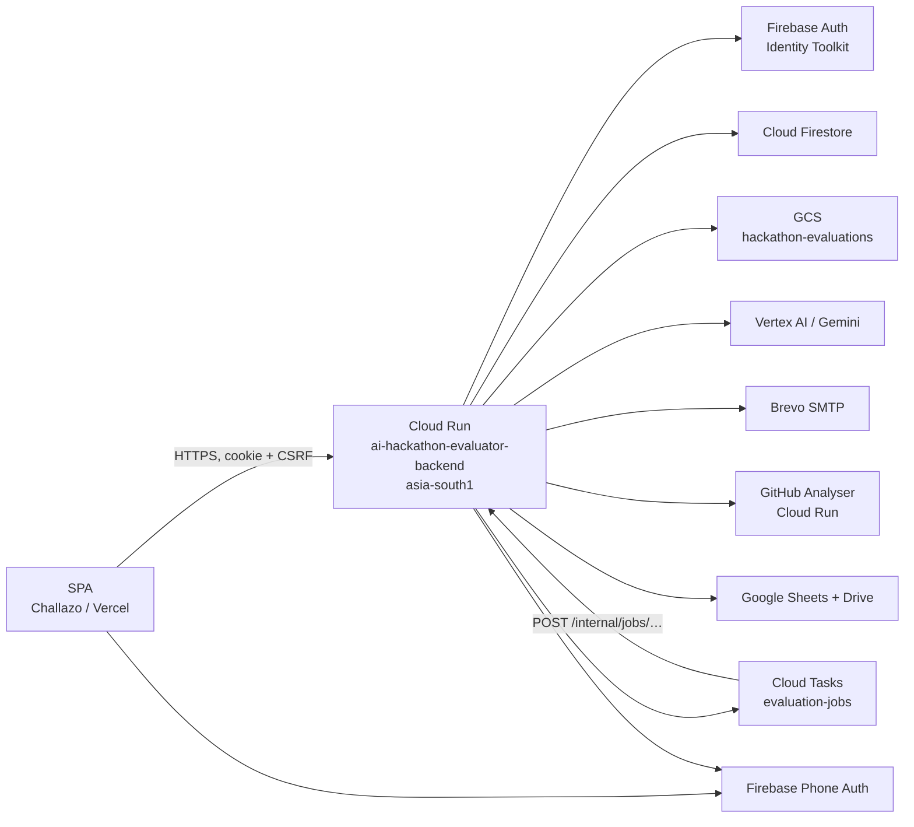
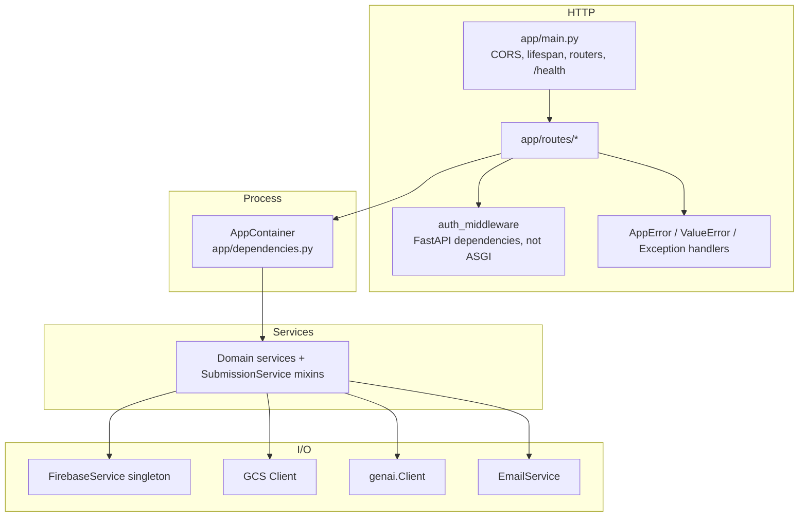
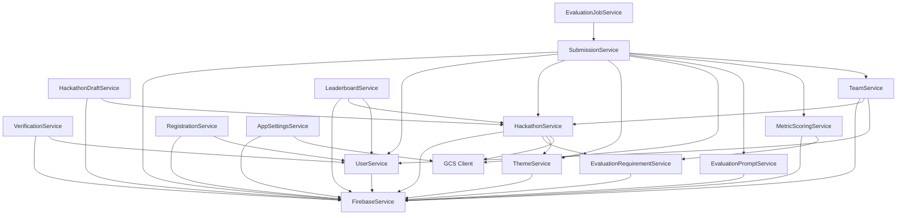
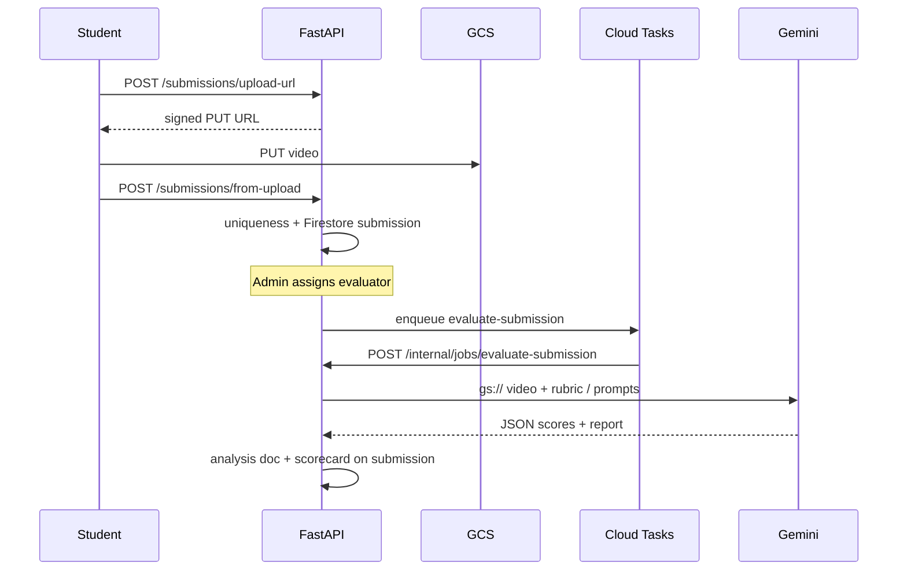

# Architecture — AI Hackathon Evaluator Backend

This document describes the **current** backend: a FastAPI API that runs hackathons (rounds, teams, submissions), AI-assisted video evaluation, optional GitHub repository analysis, admin review, and per-round leaderboards.

API contracts and frontend handoff live in the [README](../README.md). This file is the system design.

---

## 1. What the system is

Students enroll in a published hackathon round (solo or team), submit a demo (video and/or form answers), and wait for evaluation. Admins assign **approved evaluators**. Evaluators score with a rubric, optionally run **Gemini** on the demo video and an external **GitHub analyser** on a repo URL, then submit for review. Admins approve (or request changes). Students see scores and ranking only after the admin publishes.

| Concern | Choice |
|---------|--------|
| Runtime | FastAPI (Python ≥ 3.11) on Cloud Run |
| Auth | Firebase Auth (Identity Toolkit login + Admin SDK verify) |
| Database | Cloud Firestore (schemaless; collection names are conventions) |
| Object storage | GCS (`EVALUATION_BUCKET_NAME`) |
| Video AI | Vertex / Gemini (`google-genai`, multimodal `gs://` URI) |
| Repo AI | External Cloud Run analyser (`GITHUB_AI_EVALUATION_URL`) |
| Email | Brevo SMTP (OTP + leaderboard notify); optional Firestore `mail` |
| Long jobs | Cloud Tasks → `POST /internal/jobs/evaluate-submission` (local: FastAPI `BackgroundTasks`) |
| Timezone | Asia/Kolkata (IST) for dates, windows, and timestamps |

There is **no Postgres**. Firestore is the system of record. Analysis does not use a separate job worker process — Cloud Tasks HTTP-POSTs back into **this** service.

---

## 2. Design principles

1. **Routes → services → I/O.** Handlers parse HTTP, call a service, map errors. They do not talk to Firestore or Gemini directly.
2. **`FirebaseService` is the only Firebase Admin client.** Never import `firebase_admin` in routes or domain services.
3. **One process-scoped container.** `AppContainer` in `app/dependencies.py` is built in lifespan and injected with `Depends`. Constructors still work without the container (tests, scripts).
4. **Sync I/O off the event loop.** Route handlers are `async def`; Firestore, GCS, SMTP, and Identity Toolkit run through `app.utils.async_io.run_sync` (`asyncio.to_thread`).
5. **Roles live on the Firestore user document**, not Firebase custom claims: `student` | `evaluator` | `admin`. Evaluators also have `approval_status`.
6. **Clients poll.** Video AI and GitHub AI return `202` and persist status on the submission; the SPA polls `GET /submissions/{id}`.

---

## 3. System context



The SPA never calls Gemini or the GitHub analyser. Signed GCS PUT URLs let the browser upload video straight to the bucket.

---

## 4. Process layers



| Layer | Path | Responsibility |
|-------|------|----------------|
| App factory | `app/main.py` | CORS allow-list + credentials, lifespan, routers, error handlers, `/` and `/health` |
| Routes | `app/routes/` | HTTP surface; `Depends` + `run_sync` |
| Auth | `app/middleware/auth_middleware.py` | Cookie/Bearer token, CSRF, role gates |
| Models | `app/models/` | Pydantic request/response (not Firestore schemas) |
| Services | `app/services/` | Business rules |
| Utils | `app/utils/` | IST time, GCS signed URLs, OTP, round helpers, CORS |
| Errors | `app/exceptions.py` | `AppError` hierarchy (`BadRequest`, `Unauthorized`, `Forbidden`, `NotFound`, `Conflict`, `TooManyRequests`, `InfrastructureError`) |

Startup (`lifespan`):

1. `init_app_container(app)` — Firebase, GCS client, all domain services.
2. Optional `DatabaseSeeder` when `SEED_ON_STARTUP` is true (default locally; false in production Cloud Build). Seed failures are logged and **do not** abort startup.

---

## 5. HTTP surface

| Router | Prefix | Audience |
|--------|--------|----------|
| `auth` | `/auth` | Login, cookies, CSRF, register + email OTP + phone verify |
| `admin` | `/admin` | Users, evaluator approve/list |
| `settings` | `/admin/settings` | App settings, profile-password change, dangerous DB reset |
| `hackathon` | `/hackathons` | CRUD, drafts, round publish, **catalog**, leaderboard |
| `teams` | `/hackathons` | Round enrollment, create/join team, join codes |
| `submissions` | `/submissions` | Upload, assign, evaluate, GitHub AI, review, Sheets export |
| `theme` | `/themes` | Reusable problem themes |
| `evaluation_requirement` | `/evaluation-requirements` | Rubric / form field definitions |
| `evaluation_prompt` | `/ai-evaluation-prompts` | Gemini prompt templates |
| `metric_scoring` | `/ai-evaluation-metric-scoring` | Per-field scoring config |
| `internal_jobs` | `/internal/jobs` | Cloud Tasks worker (`X-Internal-Job-Secret`) — not the SPA |

Swagger (`/docs`, `/redoc`, `/openapi.json`) is on in development and off in production unless `ENABLE_API_DOCS=true`.

---

## 6. Service graph

Built once in `build_app_container()`:



`HackathonExportService` and `GoogleSheetsExportService` are constructed per request from the same container (not stored as container fields).

### SubmissionService mixins

`app/services/submission_service.py` re-exports a façade composed in `app/services/submission/service.py`:

| Mixin | File | Responsibility |
|-------|------|----------------|
| `CreateMixin` | `create.py` | Multipart and signed-URL create; uniqueness |
| `QueryMixin` | `query.py` | ACL, enrichment, lists |
| `AssignmentMixin` | `assignment.py` | Assign evaluators; optional auto-AI enqueue |
| `AnalysisMixin` | `analysis.py` | Gemini video analysis → `analysis` + scorecard |
| `GithubAiMixin` | `github_ai.py` | Gemini context + external analyser |
| `ReviewMixin` | `review.py` | Submit-for-review / approve / request-changes / publish |

Shared collections and Gemini/GCS clients live on `SubmissionServiceBase`.

---

## 7. Authentication and authorization

### Login

`POST /auth/login` does **not** mint tokens with the Admin SDK. It calls Firebase Identity Toolkit `signInWithPassword` (`FIREBASE_WEB_API_KEY`), checks `aud` / `uid` against the Firestore user, then sets:

- HttpOnly `access_token` cookie
- `csrf_token` cookie
- JSON body includes `csrf_token` (required for cross-origin SPAs; `document.cookie` cannot read the API cookie)

`Authorization: Bearer` still works for Swagger and non-browser clients.

### Request auth

`get_current_user`:

1. Cookie first, then Bearer header.
2. If the token came from the cookie and the method is mutating, require `X-CSRF-Token` matching the CSRF cookie (`CSRF_PROTECTION`).
3. Verify JWT (shape + project `aud`, then Admin SDK).
4. Load `users/{uid}`. A valid Firebase token **without** a Firestore user → 404.

| Dependency | Rule |
|------------|------|
| `get_current_user` | Authenticated |
| `get_active_user` | Evaluators must be `approved` |
| `get_student_user` | `role == student` |
| `get_evaluator_user` | `role == evaluator` and approved |
| `get_admin_user` | `role == admin` |

Pending evaluators may call `/auth/me`; other app routes return 403 until approved.

### Registration

Student and evaluator share the same verified-email + phone flow (`VerificationService`):

1. `POST /auth/register/start` → `verification_sessions` doc
2. Email OTP via `EmailService` (Brevo in prod)
3. Firebase Phone Auth in the browser → `POST /auth/verify-phone-token`
4. `POST /auth/register/complete` creates Auth + Firestore user and sets the login cookies

OTP rate limits (Firestore `otp_rate_limits`): **5 sends/hour per email**, **2000/hour per IP** (campus NAT), 60s resend cooldown. Codes are hashed (SHA-256 + pepper).

### Forgot password

Unauthenticated. Same `verification_sessions` collection with `purpose: "password_reset"`:

1. `POST /auth/forgot-password/start` — **email only**. If the address is registered, email OTP is sent immediately; response includes `mobile_last4` (UI) and `mobile_number` (Firebase Phone Auth). Unknown email → `ACCOUNT_NOT_FOUND`.
2. Reuse `POST /auth/email/send-otp`, `/email/verify-otp`, `/verify-phone-token`.
3. `POST /auth/forgot-password/reset` updates Firebase Auth password, revokes refresh tokens, deletes the session. **No login cookies** — user signs in again.

Register complete endpoints reject reset sessions (`PURPOSE_MISMATCH`).

---

## 8. Data stores

### Firestore collections

| Collection | Document | Purpose |
|------------|----------|---------|
| `users` | Firebase uid | Profile, `role`, `approval_status` |
| `verification_sessions` | session id | Registration or password-reset OTP/phone state |
| `otp_rate_limits` | `email:…` / `ip:…` | Sliding-window OTP counters |
| `hackathons` | hackathon id | Timeline rounds, themes, export sheet ids |
| `hackathon_drafts` | draft id | Admin wizard drafts before publish |
| `hackathon_enrollments` | `{hackathonId}_{roundIndex}_{userId}` | One enrollment per user per round |
| `hackathon_teams` | team id | Round-scoped team + member ids |
| `team_join_codes` | code | 6-digit codes, ~5 minute TTL |
| `submissions` | submission id | Student work, scorecard, review, GitHub AI |
| `analysis` | submission id | Gemini video result (report, checklist, scores) |
| `themes` | theme id | Problem catalogue |
| `evaluation_requirements` | requirement id | Rubric / form fields |
| `ai_evaluation_prompts` | prompt key | Gemini prompt templates |
| `ai_evaluation_metric_scoring` | scoring id | Metric scoring config |
| `app_settings` | `security` | Admin-tunable settings |
| `mail` | message id | Optional Trigger Email queue |

Firestore is not schema-enforced. Pydantic models validate **API** payloads; stored docs are dicts.

### GCS object layout

| Object | Use |
|--------|-----|
| `submissions/{student_id}/{submission_id}/video.{ext}` | Demo video |
| `hackathons/{hackathon_id}/banner…` | Banner image |

The API issues **signed PUT** URLs for browser upload and **signed GET** URLs (or a streaming proxy) for playback. Gemini is given the `gs://` URI — the video is not re-downloaded into Cloud Run.

### Round flags (`hackathons.timeline[i]`)

Stored on `TimelineRound`:

| Field | Meaning |
|-------|---------|
| `published` | Students can see and enroll |
| `max_team_size` | 1 = solo, 2–4 = team |
| `working_demo_video_required` | Video required vs form-only |
| `auto_ai_evaluation` | Queue Gemini on evaluator assign |
| `github_ai_evaluation` | Show GitHub AI button for evaluators |
| `leaderboard_published` | Students may `GET` the ranked board |

Computed `round_status`: `draft` | `scheduled` | `open` | `closed` from IST dates.

---

## 9. Domain flows

### 9.1 Hackathon lifecycle

```text
Admin draft  →  POST /hackathons
             →  publish round (students can enroll)
             →  students enroll (solo or team)
             →  one submission per student/team per round
             →  admin assigns evaluator(s)
             →  optional auto Gemini + optional GitHub AI
             →  evaluator submit-for-review
             →  admin approve (report_published + final_score)
             →  admin publish leaderboard (ranks + email)
```

### 9.2 Enrollment and teams

Per **hackathon + round index** (not per hackathon overall):

- Solo (`max_team_size == 1`): `POST …/enroll/solo`
- Team: leader `POST …/teams/create` (name + 6-digit join code) → members `POST …/teams/join`
- `GET …/participation` drives the SPA (`can_submit`, `already_submitted`, `pending_action`, team completeness)

A leftover `role: solo` enrollment on a team round blocks `choose_role` until that enrollment is removed.

### 9.3 Submit once per round

Enforced in `app/services/submission/uniqueness.py` on `POST /submissions` and `POST /submissions/from-upload`:

- Same student + hackathon + round → `409 ALREADY_SUBMITTED`
- Same team (leader already submitted) → `409` with team message
- Other rounds remain independent

### 9.4 Video upload and Gemini evaluation



Status on the submission: `uploaded` → `processing` → `completed` | `failed`. The SPA polls `GET /submissions/{id}` (and `/analysis`, `/report` when allowed).

AI scorecard prompts may include `{problem_statement}`, `{solution_description}`, `{theme}` (selected theme **description**), and `{theme_name}`. Tokens are interpolated from the submission at evaluation time. `{theme}` / `{Theme}` chips come from `GET /evaluation-requirements/{id}/scoring-setup`. Submissions snapshot `theme_description` on create.

Locally (`EVALUATION_JOB_MODE=auto` without queue config) the same `evaluate_submission` runs as a FastAPI `BackgroundTask`. That path **does not survive process restart**. Production uses Cloud Tasks and Cloud Run `--timeout=3600`.

### 9.5 Scoring, review, leaderboard

1. Evaluator fills the scorecard → `review_status=pending_review` and `final_score`.
2. Admin `approve-evaluation` → `approved` + `report_published` (student can see report/score).
3. Admin may `request-changes` back to the evaluator.
4. Leaderboard ranks **approved** submissions by `final_score` using competition ranking (100, 90, 90, 80 → 1st, 2nd, 2nd, 4th).
5. Students get `403 LEADERBOARD_NOT_PUBLISHED` until `POST …/leaderboard/publish`. Admins and evaluators can preview earlier.
6. First publish emails ranked candidates (Brevo) unless `notify: false`.

### 9.6 GitHub AI (optional)

When the round has `github_ai_evaluation` and the submission has a GitHub URL:

1. Evaluator `POST /submissions/{id}/evaluate-github-ai` → `202`
2. Gemini builds `{ provided_context, rubrics[] }` from problem/solution
3. Backend `POST`s the analyser `/analyze/sync` (wait ~120s, timeout ~130s)
4. Result is mapped onto the GitHub scorecard metric (`github_ai_status`)

The SPA never calls the analyser. Manual GitHub scoring still works if the flag is off.

---

## 10. Asynchronous evaluation jobs

`EvaluationJobService` (`EVALUATION_JOB_MODE`):

| Mode | When | Behaviour |
|------|------|-----------|
| `cloud_tasks` | Explicit, or `auto` when queue + target URL + secret + project are set | Enqueue HTTP task |
| `background` | Explicit, or `auto` when Cloud Tasks is not configured | FastAPI `BackgroundTasks` |

Worker: `POST /internal/jobs/evaluate-submission` with `X-Internal-Job-Secret`. Non-2xx responses make Cloud Tasks retry (transient Gemini/GCS failures). Invalid secret → 401 (no retry storm of unauthorized tasks if the secret is wrong — Tasks will still retry; keep the secret aligned).

GitHub AI currently runs as an in-process background task on the evaluate-github-ai request (same 202 + poll pattern), not via Cloud Tasks.

---

## 11. External integrations

| System | Role | Config |
|--------|------|--------|
| Firebase Auth | Login, phone verify, Admin token verify, user CRUD | `FIREBASE_*` |
| Firestore | All metadata | same service account |
| GCS | Videos, banners, signed URLs | `EVALUATION_BUCKET_NAME` |
| Gemini | Checklist, video scores, GitHub context | `GEMINI_MODEL`, `GOOGLE_CLOUD_LOCATION`, `GEMINI_ENTERPRISE` |
| GitHub analyser | Repo score | `GITHUB_AI_EVALUATION_URL` |
| Brevo SMTP | OTP + leaderboard email | `EMAIL_PROVIDER=smtp`, `SMTP_*` |
| Cloud Tasks | Durable video jobs | `CLOUD_TASKS_*`, `INTERNAL_JOB_SECRET` |
| Google Sheets / Drive | Admin submission export | `GOOGLE_SHEETS_EXPORT_FOLDER_ID`; share folder with `FIREBASE_CLIENT_EMAIL` |

---

## 12. Errors, CORS, and concurrency

- `AppError` → status + `{ detail }` or `{ detail: { code, message } }` when `code` is set (`ALREADY_SUBMITTED`, `RATE_LIMITED`, `LEADERBOARD_NOT_PUBLISHED`, …).
- Uncaught `ValueError` → 400 / 404 / 409 / 413 from message text.
- Unhandled `Exception` → 500 `"Internal server error"` (stack logged).
- `InfrastructureError` → 503 with a generic client body.

CORS: explicit `ALLOWED_ORIGINS`, `allow_credentials=True`. Cross-origin production (`COOKIE_SAMESITE=none`) requires HTTPS and CSRF via login JSON or `GET /auth/csrf`.

Cloud Run: **1 GiB / 1 CPU / 3600s timeout**, `--allow-unauthenticated` (auth is application-level). Scale and concurrency are ops concerns (campus OTP bursts: raise `--max-instances` / `--concurrency` rather than tightening per-IP OTP).

---

## 13. Deployment

```text
Cloud Build (cloudbuild.yaml)
  → Artifact Registry asia-south1
  → ensure GCS bucket + CORS
  → ensure Cloud Tasks queue evaluation-jobs
  → Cloud Run service ai-hackathon-evaluator-backend
```

| Environment | Entry |
|-------------|--------|
| Local | `uvicorn app.main:app --reload` on **8000**; `.env` |
| Container / Cloud Run | Dockerfile uvicorn **0.0.0.0:8080**; secrets from Secret Manager |

Production substitutions and multi-project (staging vs prod) triggers: [README — Production](../README.md#production-cross-origin-frontend) and [Multi-environment deploy](../README.md#multi-environment-deploy-staging--production).

---

## 14. Project layout

```
app/
├── main.py                 # factory, CORS, lifespan, routers, handlers
├── dependencies.py         # AppContainer + Depends providers
├── exceptions.py           # AppError hierarchy
├── middleware/
│   └── auth_middleware.py  # cookie/Bearer, CSRF, role deps
├── models/                 # Pydantic API schemas
├── routes/                 # HTTP only
├── services/
│   ├── firebase.py         # Admin SDK singleton
│   ├── submission/         # mixins (create, analysis, github_ai, review, …)
│   ├── evaluation_job_service.py
│   ├── github_ai_evaluation_service.py
│   ├── leaderboard_service.py
│   ├── team_service.py
│   ├── verification_service.py
│   ├── email_service.py
│   └── …
└── utils/                  # IST, GCS, OTP, seeder, CORS, cookies
docs/
└── architecture.md         # this file
tests/                      # pytest characterization + feature tests
cloudbuild.yaml
Dockerfile
```

---

## 15. What this is not

- The old prototype paths `/upload-video`, `/analyze-video`, and `evaluation_sessions` are **not** the product. Live evaluation is **hackathon submissions**.
- `CLAUDE.md` may still describe that prototype; prefer this document and `app/main.py`.
- No in-app notification inbox — email is OTP and leaderboard publish.
- In-process `BackgroundTasks` (local video AI, GitHub AI) are lost on Cloud Run instance restart.

For endpoint-level frontend contracts, see the README “Frontend handoff” sections (rounds/teams, GitHub AI, leaderboard, drafts, export, CSRF).
